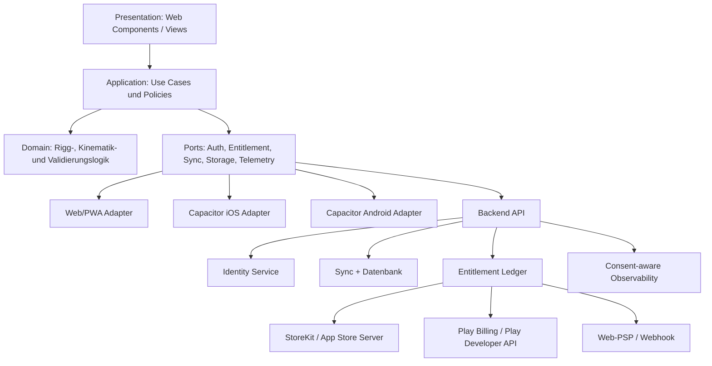

# Rudertrimm V2 — Production- und Store-Readiness

Releasebezug: **Rudertrimm V2 · 0.9.0-beta.1 · Build 2026-07-16 · shell-1f28bf1a5d5a322a**  
Shell-Revision: `sha256-1f28bf1a5d5a322a26dd19b5efdc3aff0addd97bdc29e48d0f5629732cbb0d96`.

**Dokumenttyp:** technische Zielarchitektur, Risiko- und Abnahmekatalog  
**Stand:** 16. Juli 2026  
**Zielgruppe:** Alex/Technik, spätere Mobile-/Backend-Entwicklung, QA, Betrieb  
**Status:** Architekturvorschlag — **keine Freigabe und keine Behauptung, dass V2 bereits store-ready ist**

> Dieses Dokument trennt den heute sichtbaren V2-Arbeitsstand von der Architektur, die für ein belastbares Kaufprodukt notwendig ist. Store-Regeln und Plattformanforderungen ändern sich. Die jeweils aktuellen Apple-/Google-Vorgaben müssen vor jedem Release erneut geprüft werden. Datenschutzabschnitte sind technische Leitplanken, keine Rechtsberatung.

## 1. Executive Decision

Die V2 soll **nicht** als zwei getrennte Apps und auch nicht als bloßer WebView-Klon weitergebaut werden. Empfohlen ist ein gemeinsamer, plattformneutraler Kern mit austauschbaren Adaptern:

1. Web/PWA bleibt ein erstklassiges Auslieferungsziel.
2. iOS und Android erhalten später native Shells über eine aktuelle, fest gepinnte Capacitor-Version.
3. Fachlogik, Validierung und Datenmodelle bleiben frei von DOM-, Store-, Netzwerk- und Storage-Abhängigkeiten.
4. Lokale Nutzung bleibt ohne Konto möglich; Konto und Cloud-Sync sind eine optionale Produktschicht.
5. Bezahlstatus wird niemals aus einem lokalen `isPro`-Flag abgeleitet. Ein Backend verifiziert Käufe und ist die Autorität für plattformübergreifende Entitlements.
6. StoreKit/Apple In-App Purchase, Google Play Billing und Webzahlung sind getrennte Zahlungsadapter; alle erzeugen dasselbe kanonische Entitlement-Modell.
7. Namen, Körpermaße und Trimmprofile werden als potenziell personenbezogen behandelt. Datenminimierung, Export und Löschung werden von Beginn an als Produktfunktionen gebaut.

Capacitor kann laut offizieller Dokumentation in ein bestehendes Webprojekt integriert werden und erzeugt normale iOS-/Android-Projekte; erforderlich sind unter anderem `package.json`, ein getrenntes Web-Build-Verzeichnis und dessen `index.html` ([Capacitor: Installing Capacitor](https://capacitorjs.com/docs/getting-started)). Das macht Capacitor zu einer geeigneten Packaging-Option, ersetzt aber weder native Store-Integration noch Store-Review, Datenschutz, Signing oder Backend.

## 2. Prüfstand und Readiness-Aussage

### 2.1 Was V2 bereits richtig vorbereitet

- Neun ES-Module trennen UI, Fachkern, Storage, Import, V1-Adapter, Ergebnispriorisierung,
  Sitz-/Workspace-Wächter, History und eFa-CSV-Staging.
- Domain-Schema v4 modelliert Boote, reale Sitzplätze, Profile und Zuordnungen mit stabilen IDs;
  lokaler Storage v3 hält begrenzte History/Floors, Austausch v2 bleibt rückwärtskompatibel
  und enthält lokale History nicht still.
- Bug ist Platz 1, Schlag Platz N; 3x/6x sind Vereinsklassen, Cox-Metadaten zählen bei 4+/8+
  nicht als Rudererplatz.
- Classic-Bundle, Manifest, scope-isolierter Service Worker, sicherer Import und getrennte
  Repositories sind gezielt regressiv abgesichert.
- Der sichtbare Ergebnisbereich priorisiert höchstens drei Maßnahmen aus der vorhandenen
  KPI-/Warnlogik und kann Namen vor JSON-/Druckausgabe anonymisieren.
- Personen-/Bootsstammdaten, arbeitsstandsbezogenes Quick Edit, gekoppelte Slider/Zahlfelder
  und die zustandsabhängige Einsteigerführung sind ohne paralleles Fachmodell umgesetzt und
  regressiv abgesichert.
- Revisionssnapshots entstehen atomar mit der Mutation; Alt/Neu verwendet stabile Sitz-IDs,
  bytebasierte Retention hält Bestände editierbar und Privacy-Delete entfernt alte PII.
- Ein nicht zugeordnetes gespeichertes Profil kann nach frischer Workspace-/Bootsprüfung
  passiv gelöscht werden.
- Einmaliges striktes eFa-CSV-Staging erzeugt nur unvollständige lokale Kandidaten mit
  Provenienz. Das ist keine eFa-Integration, kein Sync und kein Writeback.

Ausgeführt: **13/13 JavaScript-Parseprüfungen**, **1/1 deterministische
Bundle-Stalenessprüfung**, **235/235 Node**, **3/3 Python**.

### 2.2 Was daraus noch **nicht** folgt

Der derzeitige Arbeitsstand belegt noch keine Produktionsreife für:

- native iOS-/Android-Builds und physische Geräte;
- Store-Signing, Store-Metadaten, Review und Rollback;
- Accounts, Session-Sicherheit, Cloud-Sync oder Konfliktlösung;
- Kauf, Wiederherstellung, Refunds, Widerruf und serverseitige Kaufprüfung;
- verschlüsselte lokale Speicherung auf Native;
- Datenschutz-Workflows für Auskunft, Export und vollständige Kontolöschung;
- Telemetrie-Consent, Crash-Sanitizing und operatives Monitoring;
- automatisierte CI/CD-, Supply-Chain- und Release-Gates;
- Last-, Migrations-, Disaster-Recovery- und Sandbox-Abrechnungstests.

**Readiness-Einstufung:** technisch verbesserter Prototyp / V2-Grundlage. Nicht Production-, Commerce- oder Store-ready, bis die Abnahmekriterien dieses Dokuments nachweislich erfüllt sind.

Der Chrome-390-Kurzlauf war positiv. Offen bleiben frische reale Motion-Sichtprüfung,
vollständige 320/390-Matrix auf realen Geräten, Tastatur/Screenreader, Browser-Doppelklick,
installierte PWA, Trainer-Golden-Daten, ein realer eFa-/efaLive-
Originalexport samt Version, Spaltenmapping und echter Browser-Journey sowie Rechts-/
Storeprüfung. Automatisierte Verträge ersetzen diese Gates nicht.

## 3. Zielarchitektur



### 3.1 Schichten und harte Grenzen

| Schicht | Darf kennen | Darf nicht kennen |
|---|---|---|
| `domain` | unveränderliche Fachtypen, pure Mathematik, Validatoren | DOM, Browser, Capacitor, HTTP, Store-SDKs, lokale Datenbank |
| `application` | Domain und Port-Interfaces | konkrete Store-/Storage-/HTTP-Implementierungen |
| `ports` | stabile, kleine Verträge | Frameworkdetails und globale Singletons |
| `adapters/web` | IndexedDB, Web Share/File APIs, Service Worker | native Store-APIs |
| `adapters/native-ios` | Capacitor-Bridge, StoreKit-Plugin/Native Code, Keychain | Google Play Billing |
| `adapters/native-android` | Capacitor-Bridge, Play Billing, Android Keystore | StoreKit |
| `backend` | Auth, Sync, Verifikation, Ledger, Webhooks | Vertrauen in clientseitige Freischaltflags |
| `presentation` | ViewModels und Use Cases | rohe Tokens, Store-Belege, SQL/Storage |

### 3.2 Vorgeschlagene Projektstruktur

```text
apps/
  web/
  mobile/                 # Capacitor config + gemeinsam gebaute Web-Assets
packages/
  domain/                 # Berechnungen, Einheiten, Presets, Schema
  application/            # Use Cases, Policies, Ports
  ui/                     # plattformneutrale UI-Module
  contracts/              # API-/Event-Schemas, generierte Typen
  adapters-web/
  adapters-native/
services/
  api/
  worker/                 # Store-Notifications, Löschung, Export
tests/
  contract/
  e2e/
  fixtures/
```

Das ist ein Zielbild, kein Zwang zu einem sofortigen Monorepo-Umbau. Der nächste sichere Schritt ist, die vorhandene Fachlogik hinter stabile Ports zu stellen und erst danach Native-/Backend-Adapter hinzuzufügen.

## 4. Architecture Decision Records

### ADR-001 — Ein kanonischer Fachkern

**Entscheidung:** Alle Rigg-, Kinematik-, Einheiten-, Preset- und Validierungsregeln leben in einem plattformneutralen Paket.  
**Begründung:** Web, iOS, Android, Backend-Validierung und Tests dürfen keine abweichenden Formeln entwickeln.  
**Folge:** Domain-Funktionen akzeptieren und liefern nur explizite, versionierte Typen; keine implizite Umrechnung und keine UI-Strings als Fachwerte.

### ADR-002 — Capacitor als Packaging-Option, nicht als Architektur

**Entscheidung:** Native Apps werden erst nach stabilem Web-Build und Port-Schnittstellen über Capacitor verpackt. Die konkrete, dann unterstützte Major-Version wird gepinnt.  
**Begründung:** Capacitor kopiert das erzeugte Web-Bundle in native Projekte und synchronisiert native Dependencies ([Capacitor Getting Started](https://capacitorjs.com/docs/getting-started)). Die nativen Projekte bleiben reale Xcode-/Gradle-Projekte und müssen als solche gepflegt, getestet und signiert werden ([Capacitor iOS Deployment](https://capacitorjs.com/docs/ios/deploying-to-app-store), [Capacitor Android Deployment](https://capacitorjs.com/docs/android/deploying-to-google-play)).  
**Nicht entschieden:** konkrete IAP-, Secure-Storage- und SQLite-Plugins. Vor Auswahl sind Maintainer, Release-Frequenz, native SDK-Abdeckung, Datenschutz, Lizenz, Testbarkeit und Exit-Strategie zu prüfen.

### ADR-003 — Backend ist Autorität für bezahlte Rechte

**Entscheidung:** Der Client darf einen Kauf anstoßen und einen signierten Offline-Lease cachen, aber kein dauerhaftes Recht selbst erzeugen.  
**Begründung:** Apple stellt signierte JWS-Transaktionen und Server-APIs bereit ([Apple StoreKit Transaction](https://developer.apple.com/documentation/storekit/transaction), [App Store Server API](https://developer.apple.com/documentation/appstoreserverapi)); Google empfiehlt, den Purchase Token an ein sicheres Backend zu senden und dort zu verifizieren ([Google Play Billing Integration](https://developer.android.com/google/play/billing/integrate), [Backend Integration](https://developer.android.com/google/play/billing/backend)).

### ADR-004 — Local-first ohne Account-Zwang

**Entscheidung:** Fachrechnen, lokale Profile und Offline-Arbeit funktionieren ohne Anmeldung. Account ist erforderlich für Sync, Club-Sharing und plattformübergreifende Kaufzuordnung.  
**Begründung:** minimiert personenbezogene Daten, Ausfallabhängigkeit und Store-/Review-Komplexität.  
**Folge:** Nach Login wird lokale Datenübernahme ausdrücklich bestätigt; kein stilles Hochladen bestehender Ruderernamen oder Körpermaße.

### ADR-005 — Privacy by Design und Export/Löschung als Kern-Use-Cases

**Entscheidung:** Datenerhebung, Zweck, Aufbewahrung und Löschung werden pro Entität dokumentiert; Export und Löschung sind keine nachträglichen Admin-Skripte.  
**Begründung:** Die DSGVO nennt unter anderem Löschung, Datenübertragbarkeit, Datenschutz durch Technikgestaltung und Sicherheit der Verarbeitung; die EU-Kommission fasst die Nutzerrechte einschließlich Löschung und maschinenlesbarer Portabilität zusammen ([EU-Kommission: Rechte von Personen](https://commission.europa.eu/law/law-topic/data-protection/information-individuals_en), [Portabilität](https://commission.europa.eu/law/law-topic/data-protection/rules-business-and-organisations/dealing-citizens/can-individuals-ask-have-their-data-transferred-another-organisation_en)).  
**Unsicherheit:** Ob einzelne Körper- oder Trainingsdaten rechtlich als besondere Kategorien einzuordnen sind, hängt von Zweck, Kontext und Verknüpfung ab. Das muss vor Backend-Start juristisch klassifiziert werden.

### ADR-006 — Kein ungeprüftes Remote-Code-Update

**Entscheidung:** Store-Builds enthalten ein versioniertes, geprüftes Web-Bundle. Remote-Konfiguration darf Daten/Feature-Flags liefern, aber keinen neuen ausführbaren Code, der Review oder Release-Gates umgeht.  
**Begründung:** Store-Review und signierte Releases müssen nachvollziehbar bleiben; Apples aktuelle Review-Regeln sind vor jedem Release verbindlich zu prüfen ([App Store Review Guidelines](https://developer.apple.com/app-store/review/guidelines/)).

## 5. Verbindliche Port-Interfaces

Die vollständigen Commerce-Typen stehen in `STORE-COMMERCE-ARCHITECTURE.md`. Diese Minimalverträge sind architektonische Grenzen, keine fertige SDK-Auswahl.

```ts
interface AuthProvider {
  currentSession(): Promise<AuthSession | null>;
  signIn(request: SignInRequest): Promise<AuthSession>;
  refresh(): Promise<AuthSession>;
  signOut(scope: 'device' | 'all-devices'): Promise<void>;
  beginAccountDeletion(): Promise<DeletionRequest>;
  subscribe(listener: (session: AuthSession | null) => void): Unsubscribe;
}

interface EntitlementProvider {
  snapshot(options?: { forceRefresh?: boolean }): Promise<EntitlementSnapshot>;
  beginPurchase(productId: ProductId): Promise<PurchaseOutcome>;
  restorePurchases(): Promise<EntitlementSnapshot>;
  subscribe(listener: (snapshot: EntitlementSnapshot) => void): Unsubscribe;
}

interface SyncRepository {
  pull(cursor?: SyncCursor): Promise<PullResult>;
  push(batch: SyncMutationBatch): Promise<PushResult>;
  getConflict(id: ConflictId): Promise<SyncConflict | null>;
  resolveConflict(id: ConflictId, resolution: ConflictResolution): Promise<void>;
}

interface TelemetryPort {
  setConsent(consent: TelemetryConsent): Promise<void>;
  event(event: AllowedTelemetryEvent): void;
  exception(error: SanitizedError): void;
  flush(): Promise<void>;
}
```

Regeln:

- Kein Port gibt Store-Secrets, Refresh Tokens oder rohe Kaufbelege an die UI zurück.
- Jeder externe Response und Import wird zur Laufzeit gegen ein versioniertes Schema validiert.
- Ports sind in Tests durch In-Memory-Fakes ersetzbar.
- Abonnement-Listener liefern beim Abmelden eine `Unsubscribe`-Funktion; kein globaler Event-Bus ohne Lebenszyklus.
- Domain- und Application-Pakete importieren niemals konkrete Adapter.

## 6. Build-, Versionierungs- und Konfigurationsgrundlage

### 6.1 Erforderlich

- deterministischer Build mit gelockten Abhängigkeiten und reproduzierbarem `dist/`;
- getrennte Versionen: SemVer für gemeinsame Pakete, monotoner iOS-Build, monotoner Android-`versionCode`, Schema-/API-Version;
- Umgebungen `local`, `test`, `staging`, `production` mit getrennten Backends und Store-Sandboxes;
- keine Secrets in JavaScript-Bundle, Repository, Source Maps oder Capacitor-Konfiguration;
- nur öffentliche Konfiguration im Client: API-Origin, Environment-ID, öffentliche Schlüssel, Store-Produkt-IDs;
- CSP ohne `unsafe-eval`; Inline-Skripte/-Styles schrittweise entfernen, damit eine restriktive Policy möglich wird;
- Source Maps getrennt hochladen und nicht öffentlich ausliefern, sofern sie interne Implementierungsdetails offenlegen.

Capacitor warnt ausdrücklich davor, Secrets in Frontend-Code einzubetten, empfiehlt serverseitige Geheimnisse, Keychain/Keystore für persistente Tokens, HTTPS, PKCE bei OAuth und CSP für den WebView ([Capacitor Security](https://capacitorjs.com/docs/guides/security)).

### 6.2 Konfigurationsvertrag

```ts
type PublicRuntimeConfig = Readonly<{
  schemaVersion: 1;
  environment: 'local' | 'test' | 'staging' | 'production';
  apiBaseUrl: `https://${string}`;
  authIssuer: `https://${string}`;
  entitlementLeasePublicKeyId: string;
  productCatalogRevision: string;
  telemetryMode: 'off' | 'consent-required';
}>;
```

Der Client bricht bei unbekannter Schemaversion, unsicherer URL oder inkonsistenter Environment-Kombination kontrolliert ab. Production-App und Sandbox-Backend dürfen nicht kombinierbar sein.

### 6.3 Verbindliche Web-Header-Matrix

Die Meta-CSP der statischen V2 ist nur eine Vorschau-Härtung. Insbesondere
`frame-ancestors` wird nicht über ein CSP-Metaelement wirksam. Vor einer Web-Kaufversion muss
das Hosting beziehungsweise der vorgeschaltete Edge diese Header liefern und in CI/Staging
prüfen:

| Header | Produktionsziel | Abnahmehinweis |
|---|---|---|
| `Content-Security-Policy` | mindestens `default-src 'self'`, nonce-/hashbasierte Scripts/Styles, `object-src 'none'`, `base-uri 'none'`, `form-action 'self'`, `frame-ancestors 'none'` | zunächst `Report-Only`; Store-/Auth-/API-Domains einzeln allowlisten, niemals `*` |
| `Strict-Transport-Security` | nach HTTPS-/Subdomain-Prüfung langfristig, optional `includeSubDomains`/Preload | erst setzen, wenn jede betroffene Subdomain dauerhaft HTTPS kann |
| `X-Content-Type-Options` | `nosniff` | falsche MIME-Types müssen Build/Deployment fehlschlagen lassen |
| `Referrer-Policy` | `strict-origin-when-cross-origin` oder strenger | Kauf-, Auth- und Supportflows testen |
| `Permissions-Policy` | ungenutzte Sensoren/Funktionen explizit deaktivieren | spätere Kamera-/Bluetooth-Funktion benötigt ADR und engste Freigabe |
| `Cross-Origin-Opener-Policy` | bevorzugt `same-origin`, sofern Auth-/Store-Popups kompatibel | Popup-/Redirect-Flows in Sandbox testen; nicht blind aktivieren |
| `Cross-Origin-Resource-Policy` | für eigene statische Assets bevorzugt `same-origin` | CDN-/Font-/Downloadfälle separat prüfen |
| `Cache-Control` | HTML und `sw.js` revalidieren; inhaltsgehashte Assets langfristig `immutable`; personenbezogene API-Antworten `no-store` | Offline- und Update-Matrix als Deploymenttest |

GitHub Pages allein ist für diese vollständige Header-Matrix nur eingeschränkt steuerbar. Eine
kommerzielle Webauslieferung benötigt deshalb einen kontrollierbaren Host/Edge oder einen
nachweislich gleichwertigen Mechanismus. Native WebViews brauchen zusätzlich die im
Capacitor-/Store-Kontext dokumentierten Transport- und Navigationsregeln.

## 7. Datenhaltung und Sync

### 7.1 Speicherklassen

| Klasse | Beispiele | Web | Native | Backup |
|---|---|---|---|---|
| öffentlich | Presets, Quellen, UI-Konfiguration | Cache/IndexedDB | App Bundle/DB | unkritisch |
| Nutzerfachdaten | Boot, Rudererprofil, Maße, Trimmsnapshot | IndexedDB, XSS-gehärtet | verschlüsselte DB | bewusste Policy |
| Credentials | Refresh-/Session-Token, Geräteschlüssel | bevorzugt kurzlebig/HttpOnly-Websession | Keychain/Keystore | nie ungeschützt |
| Entitlement-Lease | signierter, begrenzter Offline-Nachweis | IndexedDB | geschützter Storage | erneuerbar |
| Telemetrie-Puffer | erlaubte technische Events | kurzlebig | kurzlebig | nicht sichern |

`localStorage` ist für eine Kaufapp kein allgemeines Repository: keine Transaktionen, kein Konfliktmodell, geringe Fehlerbehandlung und für sensible Browserdaten keine sichere Grenze gegen XSS. Migrationen müssen idempotent und rückwärts getestet sein.

### 7.2 Sync-Entität

Jede synchronisierbare Entität enthält mindestens:

```ts
type SyncEnvelope<T> = Readonly<{
  id: string;                  // UUID, clientseitig erzeugbar
  ownerId: string;
  entityType: 'rower' | 'boat' | 'trim-session';
  schemaVersion: number;
  revision: number;
  updatedAt: string;           // Serverzeit nach Commit
  deletedAt: string | null;    // Tombstone
  payload: T;
}>;
```

### 7.3 Konfliktregel

- Optimistische Nebenläufigkeit mit `baseRevision`.
- Server lehnt veraltete Mutationen als `409 conflict` ab und liefert beide Versionen.
- Kein stilles Feld-Mischen bei Fachwerten.
- UI kann „lokal behalten“, „Server behalten“ oder „als Kopie sichern“ wählen.
- Tombstones werden mindestens über das maximal unterstützte Offline-Fenster aufbewahrt; die genaue Dauer ist vor Release festzulegen.
- Team-/Club-Sharing bekommt eigene Rollen und Audit-Events; niemals `ownerId` aus dem Client übernehmen.

### 7.4 Migration und Löschung

- Jede Schemaänderung hat Up-/Rollback-Plan und Golden Fixtures aus älteren Versionen.
- „Lokal alles löschen“ funktioniert ohne Konto und räumt DB, Cache, Exportreste und Telemetrie-Puffer auf.
- „Konto löschen“ ist ein serverseitiger, nachvollziehbarer Workflow; iOS verlangt bei Apps mit Kontoerstellung eine in der App startbare Löschung ([Apple Account Deletion](https://developer.apple.com/support/offering-account-deletion-in-your-app/)). Google verlangt bei In-App-Kontoerstellung einen In-App-Pfad **und** eine Webressource für die Löschanfrage ([Google Play Account Deletion](https://support.google.com/googleplay/android-developer/answer/13327111?hl=en)).
- Löschung und Kündigung eines Store-Abos werden getrennt erklärt: Der Löschdialog darf nicht behaupten, dass die Store-Abrechnung automatisch beendet sei.
- Gesetzlich oder abrechnungstechnisch erforderliche Restdaten werden getrennt, minimiert, pseudonymisiert, zugriffsbeschränkt und mit dokumentierter Löschfrist gehalten.

## 8. Authentifizierung und Kontosicherheit

### 8.1 Empfohlenes Modell

- OIDC Authorization Code Flow mit PKCE über Systembrowser/Universal Links/App Links;
- keine Passworteingabe in einem eingebetteten fremden WebView;
- kurze Access-Token-Laufzeit, rotierende Refresh Tokens, serverseitige Session-Revoke-Liste;
- Refresh Token nativ ausschließlich in Keychain/Keystore; im Browser bevorzugt sichere, `HttpOnly`, `Secure`, `SameSite`-Cookies mit CSRF-Schutz;
- Gerätesessions im Konto sichtbar und einzeln widerrufbar;
- Rate Limits, Credential-Stuffing-Schutz, E-Mail-Verifikation und risikobasierte Reauthentifizierung für Export/Löschung;
- Recovery ohne Support-Zugriff auf Passwörter oder Klartext-Refresh-Tokens.

Bei OAuth in Capacitor muss PKCE verwendet und sollten sensitive Werte nicht über frei registrierbare Custom-URL-Schemes transportiert werden ([Capacitor Security](https://capacitorjs.com/docs/guides/security)). Wenn iOS eine Drittanbieter-/Social-Login-Option für das Primärkonto anbietet, ist Apples jeweils aktuelle Login-Services-Regel einschließlich ihrer Ausnahmen zu prüfen ([App Store Review Guidelines, 4.8](https://developer.apple.com/app-store/review/guidelines/)).

### 8.2 Abnahmekriterien Auth

- [ ] PKCE, `state` und `nonce` werden negativ getestet.
- [ ] Ein abgefangener Deep Link ohne passende laufende Auth-Transaktion wird verworfen.
- [ ] Refresh-Token-Reuse widerruft die betroffene Token-Familie.
- [ ] Logout löscht lokale Secrets; „alle Geräte“ widerruft serverseitig alle Sessions.
- [ ] Kontoübernahme erlaubt keinen Zugriff auf Daten eines anderen `ownerId`-Mandanten.
- [ ] Export und Löschung verlangen frische Authentifizierung.

## 9. Security- und Threat-Modell

### 9.1 Schutzgüter

1. Rudereridentität und Körper-/Gewichtsdaten;
2. Vereins-, Boots- und Teamdaten;
3. bezahlte Rechte und Kaufhistorie;
4. Auth-/Session-Geheimnisse;
5. Integrität der Rigg-Berechnung und Quellenstände;
6. Signing Keys, Store-API-Keys und Produktionskonfiguration;
7. Verfügbarkeit von Offline-Arbeit, Sync und Wiederherstellung.

### 9.2 Bedrohungen, Kontrollen und Nachweise

| Bedrohung | Pflichtkontrolle | Nachweis vor Release |
|---|---|---|
| Stored/DOM XSS über Namen oder Import | `textContent`/sichere DOM-APIs, keine ungeprüfte HTML-Interpolation, CSP, Schema + Längenlimit | XSS-Fixtures in Unit- und E2E-Test; CSP-Report ohne Treffer |
| manipuliertes/zu großes JSON | Streaming/Größenlimit, Content-Type, Schemavalidierung, Itemlimit, atomarer Import | Fuzz-/Property-Tests, Quota-/Abbruchtests |
| Client setzt `isPro=true` | serverseitiges Ledger, signierter Offline-Lease, serverseitige Feature-Autorisierung | manipulierte App/Clock/Storage erhält kein dauerhaftes Recht |
| Kauf-Token-Replay | Store-Verifikation, eindeutiger Source-Key, Idempotency-Key, Account-Bindung | gleicher Token parallel gegen zwei Konten getestet |
| gefälschte Store-Notification | JWS/Signatur bzw. verifizierte Provider-Nachricht, anschließende Provider-Abfrage | ungültige, alte, doppelte und out-of-order Events |
| Token-Diebstahl | Keychain/Keystore, Rotation, kurze Laufzeit, Revoke | Geräteverlust- und Session-Revoke-Test |
| Deep-Link-Hijacking | Universal/App Links, PKCE, kein Token im Link | bösartige zweite App / ungültiger Callback |
| MITM/unsicherer Endpoint | ausschließlich HTTPS, ATS/Network Security Config restriktiv | Build-Scan; `http://` blockiert |
| lokale DB-Extraktion | native DB-Verschlüsselung, Schlüssel in Secure Storage, Backup-Policy | gerootetes/Testgerät, Backup-Inspektion |
| Service-Worker-Cache-Poisoning | eigener Cache-Namespace, allowlist, versionsgebundene Assets, keine API-/Auth-Caches | Upgrade-/Rollback-/Offline-E2E |
| Clock-Rollback für Offline-Recht | signierter Lease mit Serverzeit, monotone Beobachtung, kurze TTL | Zeit vor/zurück; abgelaufener Lease |
| Telemetrie leakt Fach-/Personendaten | Event-Allowlist, Sanitizer, Consent-Gate, kurze Retention | Payload-Snapshot und Netzwerk-Mitschnitt |
| Supply-Chain-Kompromittierung | Lockfile, Pinning, SBOM, Signatur/Provenance, Dependency Review | CI-Bericht; keine unbekannten Buildskripte |
| mandantenübergreifender Zugriff | serverseitige Objekt-/Org-Autorisierung bei jedem Zugriff | BOLA/IDOR-Negativtests |
| Lösch-/Sync-Race | Accountstatus `deleting`, Mutationen blockieren, Jobs idempotent | paralleler Login/Sync/Delete-E2E |

### 9.3 Sicherheitsregeln

- Keine API-, Store-, Signing- oder Datenbank-Secrets im Client.
- Keine sensitiven Werte in URL, Log, Crash-Stack, Analytics-Property oder Push-Payload.
- Alle IDs aus dem Client sind untrusted; Autorisierung wird aus der Session abgeleitet.
- Import, Sync, Deep Link, Push und Store-Nachricht sind gleichwertige externe Eingabegrenzen.
- Backend schreibt ein append-only Purchase-Event-Audit; personenbezogene Fachdatensätze und Security Audit werden getrennt gehalten.
- Adminzugänge: MFA, Least Privilege, zeitlich begrenzte Rechte, Audit, kein Shared Account.

## 10. Entitlements, Offline und Kauf

Die vollständige Architektur steht in `STORE-COMMERCE-ARCHITECTURE.md`.

### 10.1 Grundregeln

- Storeprodukte werden in einem kanonischen Produktkatalog gemappt; IDs werden nach Veröffentlichung nicht umgedeutet.
- `PENDING` gewährt noch kein Premiumrecht.
- Refund, Revocation, Chargeback, Ablauf und Produktwechsel sind Zustände, keine Sonderfälle.
- Store-Nachrichten sind mindestens einmal zustellbar zu behandeln: idempotent, reihenfolgeunabhängig und nachverifizierbar.
- Wiederherstellung ist eine sichtbare Funktion. Apple stellt aktuelle Rechte über `Transaction.currentEntitlements` bereit und `AppStore.sync()` soll nur nach ausdrücklicher Nutzeraktion aufgerufen werden ([Apple currentEntitlements](https://developer.apple.com/documentation/storekit/transaction/currententitlements), [Apple AppStore.sync](https://developer.apple.com/documentation/storekit/appstore/sync%28%29)). Google verlangt beim Verbindungsaufbau/Foreground eine Abfrage vorhandener Käufe und empfiehlt sichere Backend-Verifikation ([Google Play Billing Integration](https://developer.android.com/google/play/billing/integrate)).
- Offline bleibt die kostenlose Kernfunktion verfügbar. Premiumzugang wird über einen signierten, serverseitig ausgestellten Lease mit klarer Ablaufzeit zwischengespeichert.
- Ein abgelaufenes Recht löscht niemals Nutzerdaten; Lesen und Export eigener Daten bleiben möglich.

### 10.2 Noch zu entscheidende Offline-Policy

Die Lease-Dauer ist eine Produkt-/Fraud-Entscheidung, kein Store-Fakt. Vorschlag für den ersten Testbetrieb:

- Subscription: maximal 7 Tage seit letzter erfolgreicher Serverprüfung und niemals über die serverseitig bekannte Berechtigung hinaus, außer der Server bestätigt einen Store-Grace-Zustand.
- Non-consumable/Lifetime: erneuerbarer 30-Tage-Lease, damit Refund/Revocation später wirksam wird.
- Nach Ablauf: Free-Modus, bestehende Daten les- und exportierbar; Premiumänderungen pausieren.

Diese Zahlen sind **Arbeitsannahmen** und müssen mit realer Offline-Nutzung am Steg, Supportaufwand und Missbrauchsrisiko validiert werden.

## 11. Datenschutz und Consent

### 11.1 Dateninventar vor Backend-Code

Für jedes Feld dokumentieren:

- Zweck und Rechtsgrundlage;
- optional oder erforderlich;
- lokal, Server oder Drittanbieter;
- Personenbezug/Verknüpfbarkeit;
- Verschlüsselung und Rollen;
- Aufbewahrung und Löschfrist;
- Exportformat;
- Store-Privacy-Kategorie;
- Telemetrieverbot oder erlaubte Aggregation.

Die EU-Kommission nennt als Transparenzangaben unter anderem Verantwortlichenkontakt, Zweck, Datenkategorien, Rechtsgrundlage, Speicherdauer, Empfänger und Drittlandtransfers ([EU-Kommission: Informationspflichten](https://commission.europa.eu/law/law-topic/data-protection/rules-business-and-organisations/principles-gdpr/what-information-must-be-given-individuals-whose-data-collected_en)).

### 11.2 Store-Deklarationen

- Apple App Privacy in App Store Connect muss eigene und Drittanbieter-Datennutzung korrekt abbilden; eine öffentlich erreichbare Privacy Policy ist erforderlich ([Apple App Privacy Details](https://developer.apple.com/app-store/app-privacy-details/)).
- Ein `PrivacyInfo.xcprivacy`-Manifest dokumentiert Datentypen/Required-Reason-APIs im Bundle; es ersetzt nicht die App-Store-Privacy-Angaben ([Apple Privacy Manifests](https://developer.apple.com/documentation/bundleresources/privacy-manifest-files)).
- Google Play verlangt die Data-Safety-Erklärung einschließlich Drittanbieter-SDKs; auch Apps ohne Datenerhebung müssen das Formular und eine Privacy Policy bereitstellen ([Google Data Safety](https://support.google.com/googleplay/android-developer/answer/10787469?hl=en)).
- Tracking für Werbung/Attribution ist nicht Bestandteil der empfohlenen V2-Basis. Falls später app-/anbieterübergreifend getrackt wird, ist auf Apple ATT erforderlich ([Apple App Tracking Transparency](https://developer.apple.com/documentation/apptrackingtransparency)).

### 11.3 Telemetrie-Consent-Modell

```ts
type TelemetryConsent = Readonly<{
  necessaryDiagnostics: boolean; // nur technisch zwingend und rechtlich geprüft
  productAnalytics: boolean;
  marketingAttribution: boolean;
  decidedAt: string;
  policyVersion: string;
}>;
```

- Default: optionale Kategorien `false`.
- Consent wird vor Event-Erzeugung geprüft, nicht erst beim Upload.
- Events enthalten keine Namen, Körpermaße, Trimmwerte, freien Texte, Kaufbelege oder vollständigen User-/Device-Identifier.
- Widerruf stoppt neue Erhebung und leert nicht erforderliche Warteschlangen.
- Die rechtliche Grundlage für notwendige Diagnostik, Consent-Text und Aufbewahrung ist vor Produktion zu bestätigen.

## 12. Observability ohne Datenschatten

### 12.1 Technische Signale

- API: Rate, p50/p95/p99, Fehlerklasse, Sättigung;
- Auth: Login-Erfolg nach Provider/Version, Refresh-Fehler, Revoke-Latenz — ohne E-Mail;
- Sync: Mutationen, Konfliktrate, Cursor-Lag, Tombstone-Fehler;
- Billing: Verifikationslatenz, Notification-Lag, Dubletten, unbestätigte Google-Käufe, Reconciliation-Differenz;
- Client: Crash-free Sessions, Startzeit, Offline-/Update-Fehler, Build-ID;
- Datenschutz: Export-/Löschjob-Laufzeit und Fehler, ohne Nutzdateninhalt.

### 12.2 Betriebsregeln

- Korrelations-ID statt personenbezogener Identifier in Logs.
- Token, JWS, Purchase Token, E-Mail, Namen und Payloads werden vor Logging redigiert.
- getrennte Zugriffsrollen und Retention für Application Logs, Security Audit und Purchase Ledger.
- Alarmierung besitzt Runbook, Verantwortlichen und Eskalationsgrenze.
- synthetische Health Checks verwenden Testmandanten und keine realen Kundendaten.

## 13. Teststrategie

### 13.1 Testpyramide

1. **Domain Unit/Property Tests:** Einheiten, Invarianten, Grenzen, NaN/Infinity, Presets, Rundung, Regressionen.
2. **Schema-/Fuzz-Tests:** Import, API, Deep Link, Sync, Store-Events, Größen- und Rekursionlimits.
3. **Application Contract Tests:** Ports mit Fakes; Offline, Reauth, Lease-Ablauf, Konflikte.
4. **Adapter-Integration:** IndexedDB/native DB, Secure Storage, HTTP Retry, Store-Sandbox.
5. **Backend-Integration:** DB-Transaktion, Idempotenz, Webhook-Reihenfolge, Mandantentrennung.
6. **E2E Web/Native:** Kernreise, Offline, Upgrade, Restore, Refund, Logout, Export, Löschung.
7. **Release-Tests:** signiertes Produktionsartefakt in TestFlight/Play Internal, physische Geräte.

### 13.2 Verbindliche Matrizen

| Matrix | Mindestfälle |
|---|---|
| Plattform | aktuelle + älteste unterstützte iOS-/Android-Version, Web Safari/Chrome/Firefox/Edge |
| Gerät | kleines Telefon, großes Telefon, Tablet, Rotation, Dynamic Type/Schriftvergrößerung |
| Netzwerk | online, langsam, offline, Abbruch während Sync/Kauf, Wiederkehr |
| Lifecycle | Cold Start, Background/Foreground, Kill während Kauf/Import/Sync |
| Billing | Erfolg, Abbruch, Pending, Duplicate, Restore, Renewal, Grace, Expiry, Refund, Revoke |
| Daten | leer, Maximalbestand, alte Schemaversion, beschädigt, konflikthaft, gelöschte Entität |
| Account | anonym, neu, bestehend, Gerätewechsel, Session abgelaufen, Konto in Löschung |

### 13.3 Release-blockierende Qualitätsgates

- 100 % der sicherheits- und entgeltkritischen Use Cases besitzen Tests.
- Keine bekannte P0/P1-Schwachstelle; keine ungeklärte kritische/hohe Dependency-Lücke.
- Kein Konsolenfehler/Unhandled Promise in den E2E-Kernreisen.
- Keine externe Eingabe gelangt ohne Laufzeitvalidierung in Domain/Storage.
- Manipulierte Clientdaten können weder fremde Daten lesen noch Premium freischalten.
- Store-Sandbox-Reconciliation stimmt mit internem Ledger überein.
- Migration von jeder unterstützten Vorgängerversion ist getestet und idempotent.
- Accessibility-/Performance-Budgets sind definiert und im CI messbar.

## 14. CI/CD, Signing und Release

### 14.1 Pull-Request-Pipeline

```text
format/lint
  -> typecheck
  -> unit + property + schema fuzz
  -> contract + integration
  -> dependency/license/secret scan + SBOM
  -> deterministic web build
  -> web E2E + accessibility + bundle budget
  -> preview deployment (keine Produktionsdaten)
```

### 14.2 Release-Pipeline

```text
protected tag/approval
  -> clean locked build
  -> native sync/build
  -> native unit/UI tests
  -> signiertes AAB/IPA-Archiv
  -> TestFlight / Play Internal
  -> Sandbox-Billing + Upgrade-Matrix
  -> manuelle Freigabe
  -> staged/phased rollout
  -> Monitoring + dokumentierter Rollback/Stop
```

Apple beschreibt TestFlight/App-Store-Auslieferung, Signing und Symbol-Upload über Xcode/App Store Connect ([Apple Distribution](https://developer.apple.com/documentation/xcode/distributing-your-app-for-beta-testing-and-releases)). Google verlangt signierte Artefakte; neue Play-Apps werden als Android App Bundle mit Play App Signing ausgeliefert, wobei Upload Key und App Signing Key getrennt behandelt werden können ([Android App Signing](https://developer.android.com/studio/publish/app-signing), [Upload App Bundle](https://developer.android.com/studio/publish/upload-bundle)).

### 14.3 Secret- und Signing-Regeln

- Apple-/Google-API-Keys und Upload-Key nie im Repository oder allgemeinen CI-Log.
- Zugriff aus CI nur über kurzlebige Identität/Secret Manager und geschützte Release-Umgebung.
- Vier-Augen-Freigabe für Production-Release und Berechtigungsänderungen.
- Android Upload Key: verschlüsselt, Recovery dokumentiert; Play App Signing aktiv.
- Apple: Rollen minimal, Distribution/App Store Connect Keys getrennt, Widerruf geprobt.
- Artefakt, Commit, Dependency-Lock, SBOM, Build-Nummer und Testergebnis werden gemeinsam archiviert.
- Rollback bedeutet bei Mobile meist Stop/Staged Rollout plus korrigierendes Update; Daten-/API-Abwärtskompatibilität muss das erlauben.

## 15. Store-Gates

### 15.1 Gemeinsame Gates

- [ ] Rechts-/Entwicklerkonten gehören der langfristig verantwortlichen Organisation, nicht einer privaten Einzeladresse ohne Übergabeplan.
- [ ] dauerhafte Bundle-/Package-ID und Domain sind festgelegt.
- [ ] Support-, Privacy-, Lösch- und gegebenenfalls AGB-URLs sind öffentlich, stabil und mobil erreichbar.
- [ ] Produktzweck und fachlicher Haftungshinweis sind klar; keine unbelegten medizinischen/leistungsdiagnostischen Versprechen.
- [ ] alle Berechtigungen sind minimal, begründet und auf realen Geräten geprüft.
- [ ] Storetexte, Screenshots und Kaufbeschreibung stimmen mit tatsächlichem Verhalten überein.
- [ ] Reviewer erhält Demo-Modus/-konto und vollständige Instruktionen, auch für Premium/Club.
- [ ] Support kann Purchase Claim, Restore, Refund, Account Merge und Löschung ohne Zugriff auf Zahlungsdaten bearbeiten.

### 15.2 Apple-spezifisch

- [ ] App Review Guidelines unmittelbar vor Submission erneut geprüft; digitale Features verwenden grundsätzlich In-App Purchase, soweit keine aktuell anwendbare Ausnahme/zugelassene Alternative greift ([Apple Review Guidelines, 3.1](https://developer.apple.com/app-store/review/guidelines/)).
- [ ] App bietet mehr als eine dünne Website-Hülle: belastbare Offline-Funktion, native Integrationen und vollständige mobile Nutzerreise; Apples Minimum-Functionality-Regel ist im Review zu berücksichtigen.
- [ ] Kontoerstellung -> Kontolöschung in der App.
- [ ] Privacy Details und Privacy Manifest sind vollständig und SDK-genau.
- [ ] gegebenenfalls gleichwertige Login-Option nach Guideline 4.8.
- [ ] Restore sichtbar; StoreKit-Verifikation, App Store Server Notifications und Refund/Revoke getestet.
- [ ] TestFlight-Build auf physischen Geräten; App Review Notes erklären Zweck, Messdaten, Offline und Käufe.

### 15.3 Google-Play-spezifisch

- [ ] aktuell geforderte Target-API und Billing-Library-Version werden beim Release dynamisch geprüft; Google betreibt eine rollierende Target-API-Policy ([Google Target API Policy](https://support.google.com/googleplay/android-developer/answer/11926878?hl=en-EN)).
- [ ] AAB + Play App Signing; Upload Key Recovery dokumentiert.
- [ ] digitale In-App-Funktionen verwenden grundsätzlich Play Billing, soweit keine aktuell anwendbare Programmausnahme greift ([Google Play Payments Policy](https://support.google.com/googleplay/android-developer/answer/9858738?hl=en)).
- [ ] Data Safety und Privacy Policy stimmen mit Build und allen SDKs überein.
- [ ] Kontoerstellung -> Löschung in App und über Weblink.
- [ ] Purchase Token serverseitig verifiziert; Pending, Acknowledge, RTDN, Refund/Void und Restore getestet.
- [ ] Internal/Closed Test erfüllt die zum Veröffentlichungszeitpunkt geltenden Konto-/Testanforderungen.

### 15.4 Zahlungsunsicherheit ausdrücklich

EU-/Storefront-Regeln für externe Angebote und alternative Zahlung ändern sich und sind programm-, region- und vertragsabhängig. Apple weist für alternative EU-Verteilung/-Zahlung auf gesonderte Bedingungen hin ([Apple App Review](https://developer.apple.com/app-store/review/)); Google erlaubt Alternativen nur in qualifizierten Regionen und nach Einschreibung in die jeweiligen Programme ([Google Payments Policy](https://support.google.com/googleplay/android-developer/answer/9858738?hl=en)).

**Daher gilt für die Architektur:** keine Regionserkennung im UI als Ersatz für Policy-Prüfung; Zahlungsfähigkeit kommt aus serverseitiger Storefront-/Programmkodierung. Vor Launch wird jede Kombination aus Land, Store, Produkttyp und Linkziel fachlich sowie rechtlich freigegeben.

## 16. Phasenplan mit Exit-Kriterien

### Phase 0 — Produkt- und Datenentscheidungen

**Lieferobjekte:** Free/Paid-Feature-Matrix, Dateninventar, Verantwortlicher, Produkt-IDs, Accountentscheidung, Offline-Lease-Policy, Supportmodell.  
**Exit:** Keine unbekannte Datenkategorie; jedes Paid Feature ist eindeutig digital/physisch/Club-Vertrag klassifiziert; offene Rechtsfragen besitzen Owner und Termin.

### Phase 1 — Engineering Foundation

**Lieferobjekte:** deterministischer Build, TypeScript-/Schema-Grenzen, Ports, CI, Migration aus V1/V2, CSP, Security Tests.  
**Exit:** Web/PWA besteht alle Domain-, Import-, Storage-, Offline- und Upgrade-Gates; keine P0/P1-Befunde.

### Phase 2 — Local-first Production PWA

**Lieferobjekte:** robustes Repository, Backup/Export/Erase, Update-UX, Fehlerzustände, Monitoring ohne PII.  
**Exit:** reale Pilotgruppe kann mehrere Wochen offline/online arbeiten; Datenverlust- und Rollbacktests bestanden.

### Phase 3 — Backend, Auth und Sync

**Lieferobjekte:** OIDC/PKCE, API, Mandantentrennung, Sync-Konflikte, Export/Löschjobs, Betriebsdashboard.  
**Exit:** Penetrations-/BOLA-Tests, Restore aus Backup, Lösch-/Export-E2E und Lastziele bestanden.

### Phase 4 — Native Shells

**Lieferobjekte:** gepinntes Capacitor, iOS-/Android-Projekte, Secure Storage, native DB, Universal/App Links, App Lifecycle.  
**Exit:** älteste + aktuelle unterstützte OS-Version auf echten Geräten; Offline, Background, Update und Migration bestanden.

### Phase 5 — Commerce

**Lieferobjekte:** Produktkatalog, Storeadapter, serverseitige Verifikation, Ledger, Notifications/RTDN, Restore, Reconciliation, Supporttools.  
**Exit:** vollständige Sandbox-Matrix inklusive Pending/Duplicate/Refund/Revoke/Grace/Restore; kein Recht allein aus Clientzustand.

### Phase 6 — Store Beta und Launch

**Lieferobjekte:** Privacy/Data Safety, Löschseiten, Store-Metadaten, TestFlight/Play Testing, Runbooks, Signing, staged rollout.  
**Exit:** alle Store-Gates grün, Reviewer kann vollständige Journey ausführen, Monitoring/On-call aktiv, Go/No-Go protokolliert.

## 17. Definition of Production Ready

Rudertrimm darf erst als „Production Ready“ bezeichnet werden, wenn alle Punkte belegt sind:

- [ ] Eine versionsgenaue Architektur- und Datenflussdokumentation entspricht dem ausgelieferten Build.
- [ ] Web, iOS und Android verwenden denselben getesteten Fachkern.
- [ ] alle externen Daten sind versioniert, validiert und größenbegrenzt.
- [ ] lokale und Cloud-Migrationen sind vorwärts sowie im Rollback-Szenario getestet.
- [ ] Sicherheits-, Datenschutz- und Store-Blocker sind geschlossen oder bewusst akzeptiert und dokumentiert.
- [ ] kein Clientpfad kann fremde Daten oder bezahlte Rechte ohne Serverautorität erhalten.
- [ ] Sync ist offlinefähig, konfliktfest und verursacht bei Retry keine Dubletten.
- [ ] Export und Löschung funktionieren Ende-zu-Ende und sind für Support nachvollziehbar.
- [ ] Telemetrie entspricht Consent, Privacy Policy, Apple Privacy Details und Google Data Safety.
- [ ] Backup-Restore, Incident Response, Schlüsselverlust, Store-Ausfall und Refund sind geprobt.
- [ ] signierte Store-Artefakte stammen reproduzierbar aus dem freigegebenen Commit.
- [ ] TestFlight/Play-Beta auf physischen Geräten ist abgenommen.
- [ ] Support- und Betriebsverantwortung ist benannt; Alarmierungen haben Runbooks.

## 18. Offene Entscheidungen mit Owner

| Entscheidung | Benötigt bis | Empfohlener Owner | Risiko bei Aufschub |
|---|---|---|---|
| Produktmodell: Einmalkauf, Abo, Club-Lizenz oder Mix | vor Backend-/SKU-Bau | Produkt + Technik | falsche Store-/Datenarchitektur |
| Welche Funktionen Free/Paid? | vor Entitlement-Code | Produkt | verstreute Feature-Gates |
| Konto optional oder für bestimmte Funktionen zwingend? | vor Auth | Produkt + Datenschutz | unnötige Daten/Review-Friktion |
| Sind Rudererprofile personenbezogen/gesundheitsbezogen im konkreten Betrieb? | vor Cloud-Pilot | Datenschutz/Jurist | falsche Schutz-/Consent-Einstufung |
| Offline-Lease-Dauer | vor Commerce-Beta | Produkt + Security | Sperrfrust oder Missbrauch |
| Team-/Club-Rollen und Datenverantwortung | vor Sharing | Verein/Produkt + Datenschutz | Mandanten-/Löschkonflikte |
| Backendregion, Unterauftragnehmer, Retention | vor Production-Daten | Technik + Datenschutz | Transfer-/Vertragsrisiko |
| Capacitor-/Plugin-Auswahl | nach stabiler PWA, vor Native | Mobile-Technik | Lock-in/ungepflegte Bridge |
| Store-/Web-Preisparität und externe Links je Region | unmittelbar vor Launch | Commerce + Rechtsprüfung | Store-Ablehnung/Sanktion |
| SLO, RPO, RTO und On-call | vor Beta mit Echtdaten | Betrieb | unbeherrschter Ausfall |

## 19. Primärquellen-Index

- [Capacitor: Installation in bestehende Webapps](https://capacitorjs.com/docs/getting-started)
- [Capacitor: Security Best Practices](https://capacitorjs.com/docs/guides/security)
- [Apple App Store Review Guidelines](https://developer.apple.com/app-store/review/guidelines/)
- [Apple StoreKit Transactions](https://developer.apple.com/documentation/storekit/transaction)
- [Apple App Store Server API](https://developer.apple.com/documentation/appstoreserverapi)
- [Apple Account Deletion](https://developer.apple.com/support/offering-account-deletion-in-your-app/)
- [Apple App Privacy Details](https://developer.apple.com/app-store/app-privacy-details/)
- [Apple Privacy Manifests](https://developer.apple.com/documentation/bundleresources/privacy-manifest-files)
- [Google Play Billing Integration](https://developer.android.com/google/play/billing/integrate)
- [Google Play Backend Integration](https://developer.android.com/google/play/billing/backend)
- [Google Play Payments Policy](https://support.google.com/googleplay/android-developer/answer/9858738?hl=en)
- [Google Data Safety](https://support.google.com/googleplay/android-developer/answer/10787469?hl=en)
- [Google Account Deletion](https://support.google.com/googleplay/android-developer/answer/13327111?hl=en)
- [EU-Kommission: Datenschutzrechte](https://commission.europa.eu/law/law-topic/data-protection/information-individuals_en)
