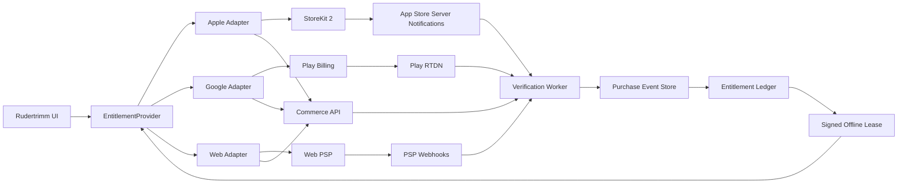
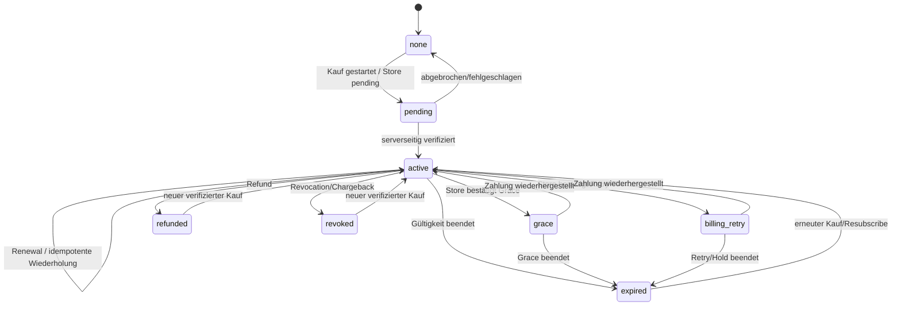
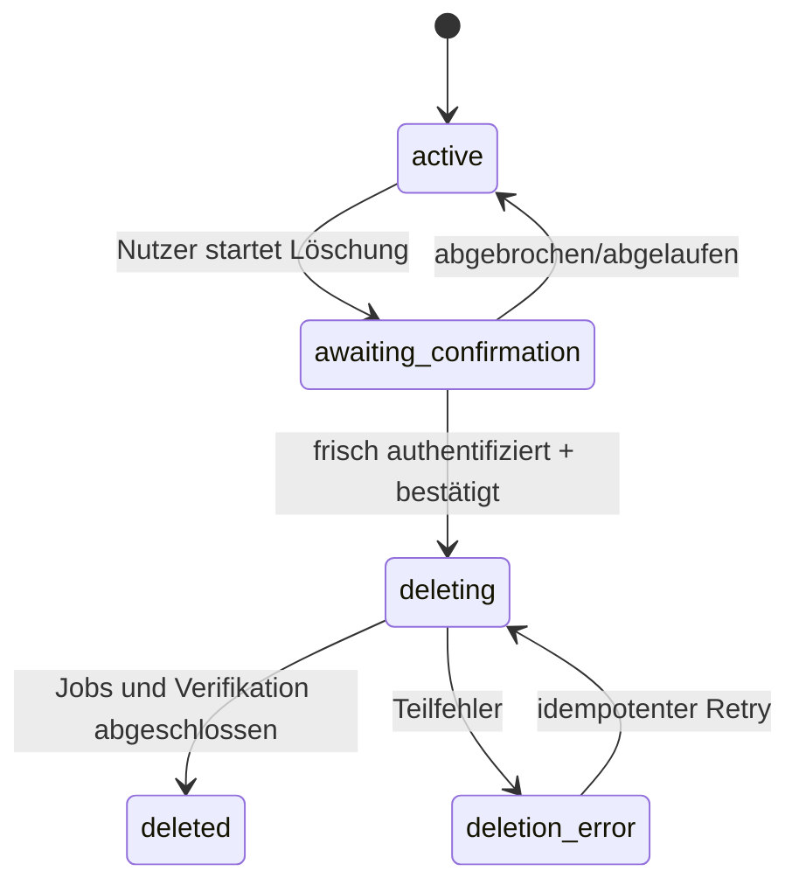

# Rudertrimm V2 — Store- und Commerce-Architektur

**Dokumenttyp:** implementierbare technische Spezifikation  
**Stand:** 15. Juli 2026  
**Geltung:** Web/PWA, iOS, Android, Backend und Support  
**Status:** Zielbild und Abnahmekriterien — **noch nicht implementiert und keine Store-Ready-Freigabe**

> Der Zweck dieses Dokuments ist nicht, schon jetzt einen Preis oder Zahlungsanbieter festzulegen. Es verhindert, dass spätere Bezahlfunktionen direkt in UI oder Fachlogik verdrahtet werden. Store- und Rechtsregeln sind zeit-, vertrags-, region- und produkttypabhängig. Vor einem echten Verkauf sind die aktuellen Regeln erneut zu prüfen; dies ist keine Rechtsberatung.

## 1. Entscheidung in einem Satz

Rudertrimm erhält einen **kanonischen, serverseitigen Entitlement Ledger**. Apple StoreKit, Google Play Billing und ein späterer Web-Payment-Service sind austauschbare Zahlungsquellen, die verifizierte Ereignisse in dieses Ledger schreiben; App und Fachlogik konsumieren ausschließlich ein normalisiertes, signiertes Berechtigungs-Snapshot.



## 2. Produkt- und Policy-Klassifikation vor Code

### 2.1 Zulässige Produktklassen im Katalog

```ts
type CommercialProductKind =
  | 'digital_non_consumable'
  | 'digital_subscription'
  | 'physical_service'
  | 'club_contract';
```

| Klasse | Beispiel für Rudertrimm | Standard-Zahlweg in nativer App | Hinweis |
|---|---|---|---|
| `digital_non_consumable` | dauerhafte Freischaltung eines Export-/Profiwerkzeugs | Apple IAP / Play Billing | Restore, Refund und Revocation erforderlich |
| `digital_subscription` | Cloud-Sync, Club-Funktionen, laufende Fachupdates | Apple/Google Subscription | Renewal, Billing Retry, Grace, Pause/Hold, Ablauf |
| `physical_service` | reale Vermessung/Trimmsitzung am Boot | externer Zahlungsweg kann möglich sein | exakte Store-Ausnahme vor Umsetzung prüfen |
| `club_contract` | B2B-Vertrag mit Verein | Web/Rechnung/Admin-Entitlement | ob und wie Zugriff in Store-App ohne IAP angeboten/kommuniziert werden darf, vor Review prüfen |

Apple verlangt für das Freischalten digitaler App-Funktionen grundsätzlich In-App Purchase ([App Store Review Guidelines, 3.1.1](https://developer.apple.com/app-store/review/guidelines/)). Google verlangt für digitale In-App-Funktionen grundsätzlich Google Play Billing, soweit keine ausdrücklich anwendbare Ausnahme oder ein qualifiziertes Alternativprogramm greift ([Google Play Payments Policy](https://support.google.com/googleplay/android-developer/answer/9858738?hl=en)).

**Wichtig:** Eine Funktion wird nicht dadurch zu einer „physischen Dienstleistung“, dass zusätzlich ein Verein oder Trainer beteiligt ist. Klassifiziert wird, wofür konkret bezahlt wird. Diese Zuordnung muss pro SKU dokumentiert sein.

### 2.2 Startkatalog — bewusst klein

Empfohlene technische Platzhalter, noch keine endgültige Preisentscheidung:

| Kanonische ID | Zweck | Apple/Google-Typ | Phase |
|---|---|---|---|
| `rudertrimm.pro.lifetime.v1` | einmalige Pro-Freischaltung | non-consumable / one-time product | optionaler Pilot |
| `rudertrimm.pro.monthly.v1` | Pro + Sync monatlich | auto-renewable subscription | nach Backend/Sync |
| `rudertrimm.pro.yearly.v1` | Pro + Sync jährlich | auto-renewable subscription | nach Monatsabo |
| `rudertrimm.club.seat.v1` | Club-Mitgliedssitz | serververwaltetes Vertragsrecht | spätere B2B-Phase |

Noch **keine** Consumables, Coins oder verbrauchbaren Credits. Produkt-IDs werden nie recycelt oder nach Veröffentlichung inhaltlich umgedeutet. Preis und Trial sind Store-Metadaten, nicht fest im App-Bundle verdrahtet.

## 3. Kanonisches Datenmodell

### 3.1 Product Catalog

```ts
type ProductId = string & { readonly __brand: 'ProductId' };
type Storefront = 'apple' | 'google' | 'web' | 'admin';

type ProductCatalogEntry = Readonly<{
  productId: ProductId;
  revision: number;
  kind: CommercialProductKind;
  featureSet: readonly FeatureKey[];
  storeProducts: Partial<Record<Storefront, string>>;
  activeFrom: string;
  activeUntil: string | null;
  replaces: ProductId | null;
}>;

type FeatureKey =
  | 'pro.calculation'
  | 'pro.export'
  | 'cloud.sync'
  | 'club.sharing'
  | 'club.admin';
```

Regeln:

- Der Client lädt einen signierten bzw. serverauthentisierten Katalog und zeigt Preise ausschließlich aus dem jeweiligen Store-SDK.
- Ein fehlendes Storeprodukt ist ein kontrollierter „nicht verfügbar“-Zustand, kein Fallback auf einen hart codierten Preis.
- Der Server akzeptiert nur Store-Produkt-IDs, die im aktiven Katalog exakt gemappt sind.
- Feature-Gates referenzieren `FeatureKey`, niemals Store-SKU oder Preis.

### 3.2 Purchase Source Record

```ts
type PurchaseSourceRecord = Readonly<{
  id: string;
  source: Storefront;
  sourceKeyHash: string;       // hash/alias, nicht rohes Token im allgemeinen Log
  providerCredentialRef: string; // Verweis auf separat verschlüsselten Token/Providerbezug
  accountId: string;
  productId: ProductId;
  sourceProductId: string;
  environment: 'sandbox' | 'production';
  state: PurchaseState;
  purchasedAt: string | null;
  validUntil: string | null;
  revokedAt: string | null;
  lastVerifiedAt: string;
  sourceVersion: number;
}>;

type PurchaseState =
  | 'pending'
  | 'active'
  | 'in_grace'
  | 'billing_retry'
  | 'paused'
  | 'expired'
  | 'refunded'
  | 'revoked'
  | 'unknown';
```

`unknown` ist fail-closed für neue Premiumaktionen, löst aber eine Reconciliation aus und löscht keine Nutzerdaten.

`providerCredentialRef` zeigt auf einen verschlüsselten, nur für den Verification Worker lesbaren Datensatz. Der Hash dient Deduplizierung und Logging; er ersetzt nicht den Google Purchase Token bzw. den für spätere Providerabfragen erforderlichen Apple-/Web-Bezug. Schlüsselrotation und Lösch-/Aufbewahrungsfrist dieses Vault-Datensatzes werden separat getestet.

### 3.3 Append-only Purchase Event

```ts
type PurchaseEvent = Readonly<{
  eventId: string;
  source: Storefront;
  sourceEventId: string;
  sourceKeyHash: string;
  receivedAt: string;
  occurredAt: string | null;
  eventType: string;
  verification: 'verified' | 'rejected' | 'deferred';
  payloadDigest: string;
  processingVersion: number;
}>;
```

- Unique Constraint: `(source, sourceEventId)`.
- Rohe Provider-Payload nur verschlüsselt, zugriffsbeschränkt und nach definierter Frist; allgemeine Logs erhalten nur Digest/Metadaten.
- Eventverarbeitung ist idempotent und kann aus dem Audit neu aufgebaut werden.
- Providerereignis allein genügt bei Unsicherheit nicht: Backend fragt den aktuellen Status beim Store ab.

### 3.4 Entitlement Snapshot

```ts
type EntitlementState =
  | 'none'
  | 'pending'
  | 'active'
  | 'grace'
  | 'expired'
  | 'revoked'
  | 'unknown';

type EntitlementGrant = Readonly<{
  feature: FeatureKey;
  state: EntitlementState;
  source: Storefront;
  productId: ProductId;
  validFrom: string;
  validUntil: string | null;
  reason: 'purchase' | 'subscription' | 'club_assignment' | 'support_override';
}>;

type EntitlementSnapshot = Readonly<{
  schemaVersion: 1;
  accountId: string;
  revision: number;
  generatedAt: string;
  grants: readonly EntitlementGrant[];
  effectiveFeatures: readonly FeatureKey[];
  verification: 'online' | 'signed_offline_lease' | 'none';
  leaseExpiresAt: string | null;
}>;
```

`effectiveFeatures` wird serverseitig deterministisch aus Grants berechnet. Der Client darf es zur Darstellung cachen, aber bei servergeschützten APIs wird jedes Feature zusätzlich serverseitig autorisiert.

## 4. Verbindliche Client-Ports

Die Interfaces werden in einem plattformneutralen `contracts`-Paket geführt. Die folgenden Definitionen sind der normative Entwurf.

### 4.1 `AuthProvider`

```ts
type AuthMethod = 'email_link' | 'passkey' | 'apple' | 'google';

type AuthSession = Readonly<{
  accountId: string;
  sessionId: string;
  assurance: 'normal' | 'fresh';
  expiresAt: string;
  methods: readonly AuthMethod[];
}>;

type SignInRequest = Readonly<{
  method: AuthMethod;
  returnTo: 'app' | 'web';
}>;

type DeletionRequest = Readonly<{
  requestId: string;
  state: 'awaiting_confirmation' | 'queued' | 'processing';
  requestedAt: string;
}>;

type Unsubscribe = () => void;

interface AuthProvider {
  currentSession(): Promise<AuthSession | null>;
  signIn(request: SignInRequest): Promise<AuthSession>;
  refresh(): Promise<AuthSession>;
  requireFreshAuthentication(reason: 'export' | 'delete' | 'security'): Promise<AuthSession>;
  signOut(scope: 'device' | 'all-devices'): Promise<void>;
  beginAccountDeletion(): Promise<DeletionRequest>;
  subscribe(listener: (session: AuthSession | null) => void): Unsubscribe;
}
```

**Invarianten:**

- UI erhält keinen Refresh Token.
- Abgebrochene Anmeldung ist ein typisierter Ausgang, kein generischer Fehler.
- Native OAuth verwendet Authorization Code + PKCE und verifizierte Universal/App Links; keine Secrets im Custom-URL-Callback. Capacitor nennt PKCE und sichere Deep Links ausdrücklich als Schutz ([Capacitor Security](https://capacitorjs.com/docs/guides/security)).
- Drittanbieterlogin auf iOS wird gegen Apples aktuelle Guideline 4.8 geprüft ([Apple Review Guidelines](https://developer.apple.com/app-store/review/guidelines/)).

### 4.2 `EntitlementProvider`

```ts
type PurchaseOutcome =
  | Readonly<{ status: 'completed'; snapshot: EntitlementSnapshot }>
  | Readonly<{ status: 'pending'; providerReference: string }>
  | Readonly<{ status: 'cancelled' }>
  | Readonly<{ status: 'unavailable'; reason: string }>;

interface EntitlementProvider {
  products(): Promise<readonly DisplayProduct[]>;
  snapshot(options?: { forceRefresh?: boolean }): Promise<EntitlementSnapshot>;
  beginPurchase(productId: ProductId): Promise<PurchaseOutcome>;
  restorePurchases(): Promise<EntitlementSnapshot>;
  openSubscriptionManagement(): Promise<void>;
  subscribe(listener: (snapshot: EntitlementSnapshot) => void): Unsubscribe;
}

type DisplayProduct = Readonly<{
  productId: ProductId;
  title: string;
  description: string;
  formattedPrice: string;
  period: 'none' | 'month' | 'year';
  trialDescription: string | null;
  available: boolean;
}>;
```

**Invarianten:**

- Preisformatierung kommt vom Store/Provider, nicht aus eigener Währungslogik.
- `completed` wird erst nach lokaler Store-Verifikation und serverseitiger Bestätigung geliefert; bei temporärem Serverausfall bleibt der Zustand rekonstruierbar.
- `pending` schaltet keine Features frei.
- Der Adapter beobachtet Transaktionsupdates während der gesamten App-Laufzeit.
- Restore ist idempotent und erzeugt keine doppelten Grants.

### 4.3 `SyncRepository`

```ts
type SyncCursor = string & { readonly __brand: 'SyncCursor' };
type ConflictId = string & { readonly __brand: 'ConflictId' };

type SyncMutation = Readonly<{
  mutationId: string;
  entityId: string;
  entityType: 'rower' | 'boat' | 'trim-session';
  baseRevision: number | null;
  operation: 'upsert' | 'delete';
  payload: unknown;
  clientCreatedAt: string;
}>;

type SyncMutationBatch = Readonly<{
  batchId: string;
  mutations: readonly SyncMutation[];
}>;

type PullResult = Readonly<{
  cursor: SyncCursor;
  changes: readonly unknown[];
  hasMore: boolean;
}>;

type PushResult = Readonly<{
  acceptedMutationIds: readonly string[];
  conflicts: readonly SyncConflict[];
  cursor: SyncCursor;
}>;

type SyncConflict = Readonly<{
  id: ConflictId;
  entityId: string;
  local: unknown;
  remote: unknown;
}>;

type ConflictResolution =
  | Readonly<{ strategy: 'keep_local' }>
  | Readonly<{ strategy: 'keep_remote' }>
  | Readonly<{ strategy: 'save_local_as_copy' }>;

interface SyncRepository {
  pull(cursor?: SyncCursor): Promise<PullResult>;
  push(batch: SyncMutationBatch): Promise<PushResult>;
  getConflict(id: ConflictId): Promise<SyncConflict | null>;
  resolveConflict(id: ConflictId, resolution: ConflictResolution): Promise<void>;
}
```

**Commerce-Bezug:** Sync und Entitlement sind getrennt. Der Verlust von `cloud.sync` stoppt neue Cloud-Mutationen, löscht aber weder lokale Daten noch Exportfähigkeit. Serverendpunkte prüfen das Feature unabhängig vom Client.

### 4.4 `TelemetryPort`

```ts
type TelemetryConsent = Readonly<{
  productAnalytics: boolean;
  diagnostics: boolean;
  marketingAttribution: boolean;
  policyVersion: string;
  decidedAt: string;
}>;

type AllowedTelemetryEvent =
  | Readonly<{ name: 'purchase_flow_started'; productId: ProductId; storefront: Storefront }>
  | Readonly<{ name: 'purchase_flow_outcome'; outcome: 'completed' | 'pending' | 'cancelled' | 'failed'; storefront: Storefront }>
  | Readonly<{ name: 'restore_outcome'; outcome: 'changed' | 'unchanged' | 'failed'; storefront: Storefront }>
  | Readonly<{ name: 'sync_outcome'; outcome: 'ok' | 'conflict' | 'failed' }>
  | Readonly<{ name: 'offline_lease_state'; state: 'valid' | 'near_expiry' | 'expired' }>;

type SanitizedError = Readonly<{
  code: string;
  component: 'auth' | 'billing' | 'sync' | 'storage' | 'ui';
  buildId: string;
  stackFingerprint: string | null;
}>;

interface TelemetryPort {
  setConsent(consent: TelemetryConsent): Promise<void>;
  event(event: AllowedTelemetryEvent): void;
  exception(error: SanitizedError): void;
  flush(): Promise<void>;
}
```

**Verbotene Properties:** Account-ID, E-Mail, Name, Körpermaß, Gewicht, Bootname, freie Eingabe, JWS, Purchase Token, Transaktions-ID, IP in Application Event, genaue Trimmwerte. Marketing-/anbieterübergreifendes Tracking ist nicht Teil der Basis; falls es später eingeführt wird, gelten zusätzliche Consent- und auf Apple gegebenenfalls ATT-Anforderungen ([Apple App Tracking Transparency](https://developer.apple.com/documentation/apptrackingtransparency)).

## 5. Backend-Komponenten

### 5.1 Services

| Komponente | Verantwortung | Darf nicht |
|---|---|---|
| Identity | Konten, Sessions, Verifikation, Geräte, Löschstatus | Kaufstatus aus Client übernehmen |
| Commerce API | Kaufclaim annehmen, Status/Lease liefern | Storebeleg ungeprüft in Grant umwandeln |
| Verification Worker | Store-API/JWS/Webhook prüfen, normalisieren | UI-Zustand speichern |
| Purchase Event Store | unveränderliche Ereignisse/Deduplizierung | Fachprofile enthalten |
| Entitlement Projector | kanonische Grants/Snapshot berechnen | Preise/Marketingtexte bestimmen |
| Notification Consumer | Apple/Google/Web-Events idempotent annehmen | Eventreihenfolge voraussetzen |
| Reconciliation Job | Store gegen internes Ledger abgleichen | still Rechte erteilen ohne Audit |
| Sync Service | Fachdatensync/Mandantenrechte | Billing-Provider direkt aufrufen |
| Export/Delete Worker | Nutzerrechte/Retention umsetzen | Store-Abo als „gekündigt“ behaupten |

### 5.2 Minimale API

```text
GET    /v1/catalog
GET    /v1/entitlements
POST   /v1/entitlements/lease
POST   /v1/purchases/apple/claim
POST   /v1/purchases/google/claim
POST   /v1/purchases/restore/reconcile
GET    /v1/purchases/history-summary
POST   /v1/sync/pull
POST   /v1/sync/push
POST   /v1/account/export
POST   /v1/account/deletion
GET    /v1/account/deletion/{requestId}

POST   /webhooks/apple/app-store
POST   /webhooks/google/rtdn
POST   /webhooks/web-payment
```

### 5.3 Request-Regeln

- Authentifizierte Mutationen benötigen `Idempotency-Key` und `X-Client-Build`.
- Bodygrößen, Schemaversion und Content-Type werden vor Verarbeitung geprüft.
- Purchase Claims sind an Account, App/Package, Environment und Storeprodukt gebunden.
- Idempotente Antwort auf denselben Claim; parallele Claims werden serialisiert.
- Das Backend vertraut keiner clientseitigen Zeit, keinem Preis und keinem Entitlementstatus.
- Rate Limit nach Account, Session, IP-/Risikosignal und Kauf-Source-Key; keine Kontenexistenz leaken.
- Fehlerantworten enthalten stabile Codes, aber keine Provider-Payload oder internen Schlüssel.

## 6. Apple-Flow

### 6.1 Kauf

1. App lädt `Product`-Informationen über StoreKit und mappt sie auf kanonische IDs.
2. Nutzer startet den Kauf ausdrücklich; App übergibt, soweit StoreKit dies unterstützt, einen stabilen pseudonymen `appAccountToken` (UUID) und prüft dessen Rückgabe später serverseitig. Keine E-Mail oder Rudererkennung wird an den Storebezug gehängt.
3. StoreKit liefert Erfolg, Pending, Abbruch oder Fehler.
4. Nur eine von StoreKit als `verified` gelieferte Transaktion wird weiterverarbeitet. Apple signiert Transaktionen als JWS; `VerificationResult` unterscheidet verified/unverified ([StoreKit Transaction](https://developer.apple.com/documentation/storekit/transaction), [VerificationResult](https://developer.apple.com/documentation/storekit/verificationresult)).
5. App sendet die JWS-Repräsentation und kanonische Produkt-ID an `/purchases/apple/claim`.
6. Backend verifiziert JWS mit Apples Server Library/Vertrauenskette und prüft mindestens Bundle-ID, Environment, Produkt, Transaktionsbezug, Kauf-/Ablauf-/Revocation-Status und Accountbindung. Die App Store Server API liefert signierte Transaktions- und Aboinformationen ([App Store Server API](https://developer.apple.com/documentation/appstoreserverapi)).
7. Backend schreibt Purchase Event + Source Record in einer idempotenten Transaktion und projiziert das Entitlement.
8. App erhält Snapshot/Lease, schaltet Features und beendet die StoreKit-Transaktion erst entsprechend dem verifizierten Lieferpfad.

### 6.2 Laufende Änderungen

- App hört `Transaction.updates` während der Laufzeit ab.
- Backend verarbeitet App Store Server Notifications V2 über getrennte Sandbox-/Production-URLs; Apple liefert damit Echtzeitereignisse zu In-App Purchases ([App Store Server Notifications](https://developer.apple.com/documentation/storekit/enabling-app-store-server-notifications)).
- Doppelte/out-of-order Notifications werden über Event-ID und anschließende Statusabfrage beherrscht.
- Renewal, Grace, Billing Retry, Expiry, Refund und Revocation werden auf kanonische Zustände gemappt.
- Ein Nachtjob reconciliert aktive/unklare Abos gegen Apple, um verlorene Notifications abzufangen.

### 6.3 Restore

1. Beim Start/Accountwechsel iteriert die App `Transaction.currentEntitlements`; Apple beschreibt diese Sequenz als aktuelle Transaktionen für Non-consumables und Abos ([Apple currentEntitlements](https://developer.apple.com/documentation/storekit/transaction/currententitlements)).
2. Jede verified Transaktion wird idempotent ans Backend geclaimt.
3. Ein sichtbarer „Käufe wiederherstellen“-Befehl ruft bei expliziter Nutzeraktion `AppStore.sync()` auf. Apple weist darauf hin, dass dies einen Systemdialog auslösen kann und nicht automatisch bei jedem Start erfolgen soll ([Apple AppStore.sync](https://developer.apple.com/documentation/storekit/appstore/sync%28%29)).
4. Backend verbindet bekannte Originaltransaktion mit dem angemeldeten Rudertrimm-Konto.
5. Konflikt „Kauf bereits anderem Konto zugeordnet“ wird nicht automatisch überschrieben; Support-/Account-Merge-Flow mit Eigentumsnachweis.

### 6.4 Apple-Abnahmekriterien

- [ ] StoreKit Configuration Unit Tests und Sandbox-Test auf physischem Gerät.
- [ ] verified/unverified, Abbruch, Ask-to-Buy/Pending, Duplicate Claim.
- [ ] Renewal, Grace/Billing Retry, Expiry, Refund, Revocation.
- [ ] Restore nach Neuinstallation, Gerätewechsel und Rudertrimm-Accountwechsel.
- [ ] verlorene/doppelte/out-of-order Server Notification.
- [ ] Sandbox und Production sind strikt getrennt.
- [ ] Subscription Management erreichbar; Löschung erklärt getrennte Kündigung.
- [ ] Review-Demokonto/-modus zeigt Free und Paid Journey.

## 7. Google-Play-Flow

### 7.1 Kauf

1. App baut eine robuste `BillingClient`-Verbindung auf und lädt Produktdetails.
2. Nutzer startet Play Billing; ein pseudonymer Accountbezug wird über die dafür vorgesehenen obfuskierten Accountfelder gesetzt, niemals als E-Mail/Klarname. Der lokale Adapter behandelt `PENDING` ohne Freischaltung.
3. Bei `PURCHASED` sendet die App den `purchaseToken`, Storeprodukt und kanonische Produkt-ID an `/purchases/google/claim`.
4. Backend ruft die passende Google Play Developer API auf und prüft Package, Produkt, Kaufstatus, Acknowledgement, Ablauf, Accountbezug sowie bereits erfolgte Zuordnung. Google empfiehlt explizit, den Purchase Token ans Backend zu senden und dort über `Purchases.products:get` oder `Purchases.subscriptionsv2:get` zu verifizieren ([Google: Fight Fraud and Abuse](https://developer.android.com/google/play/billing/security), [Backend Integration](https://developer.android.com/google/play/billing/backend)).
5. Erst nach verifiziertem `PURCHASED` schreibt das Backend Grant/Ledger.
6. Backend bestätigt den Kauf bevorzugt serverseitig. Google verlangt, Käufe nach Rechtgewährung zeitnah zu bestätigen; nicht bestätigte Käufe können automatisch erstattet werden ([Google Play Billing Integration](https://developer.android.com/google/play/billing/integrate)).
7. App erhält Snapshot/Lease.

### 7.2 Laufende Änderungen

- Beim Billing-Verbindungsaufbau und bei Foreground ruft der Adapter `queryPurchasesAsync()` auf, damit Käufe außerhalb/bei unterbrochener App verarbeitet werden; dies ist Teil der offiziellen Integrationsanleitung ([Google Play Billing Integration](https://developer.android.com/google/play/billing/integrate)).
- Real-time Developer Notifications (RTDN) werden über einen gesicherten Cloud-Pub/Sub-Consumer angenommen, dedupliziert und anschließend über die Developer API verifiziert ([Google RTDN Reference](https://developer.android.com/google/play/billing/rtdn-reference)).
- `PENDING` gewährt kein Recht; Übergang zu `PURCHASED` wird später erneut verarbeitet.
- Subscription State, Grace, Account Hold, Pause, Expiry und Resubscribe werden auf das kanonische Modell gemappt, ohne nur den Notification-Typ zu vertrauen.
- Voided Purchases/Refunds werden reconciliert und können Grants widerrufen.

### 7.3 Restore

Google hat keinen identischen globalen „Restore“-Dialog wie Apple. Der sichtbare Restore-Befehl:

1. verbindet BillingClient neu;
2. ruft `queryPurchasesAsync()` für relevante Produkttypen auf;
3. sendet alle gekauften Tokens idempotent ans Backend;
4. triggert serverseitige Reconciliation;
5. lädt den neuen Entitlement Snapshot.

### 7.4 Google-Abnahmekriterien

- [ ] Play Internal Test auf physischem Gerät mit License Tester.
- [ ] Erfolg, User Cancel, Pending->Purchased, Duplicate Token, bereits acknowledged.
- [ ] Acknowledge-Fehler/Retry und Alarm für drohende unbestätigte Käufe.
- [ ] Renewal, Planwechsel, Grace, Hold/Pause, Expiry, Resubscribe.
- [ ] Refund, Voided Purchase, RTDN-Dublette und Reihenfolgefehler.
- [ ] Restore nach Neuinstallation/Gerätewechsel/Accountwechsel.
- [ ] Package-/Environment-Mismatch wird abgewiesen.
- [ ] Target API, Billing Library und Play-Policy unmittelbar vor Release erneut geprüft.

## 8. Webzahlung und Club-Lizenzen

### 8.1 Web-Checkout

Ein späterer `WebBillingAdapter` darf ausschließlich mit einem serverseitig erzeugten Checkout arbeiten:

1. authentifizierter Client fordert Checkout-Session für kanonisches Produkt an;
2. Backend bestimmt Produkt, Währung, Preisregel und erlaubten Kanal;
3. Browser wird zur gehosteten Zahlungsseite weitergeleitet;
4. ausschließlich verifizierter Provider-Webhook erzeugt Purchase Event;
5. Rückkehr-URL zeigt „wird bestätigt“, bis Ledger aktualisiert ist;
6. Client-Redirect allein erteilt nie ein Recht;
7. Refund/Chargeback/Subscription Update kommt ebenfalls über Webhook + Provider-Reconciliation.

Rudertrimm speichert keine Kartendaten. Der konkrete PSP wird erst nach Datenschutz-, EU-/Steuer-, Support-, Webhook-, Sandbox-, Export- und Vendor-Lock-in-Prüfung gewählt.

### 8.2 Native App und externe Zahlung

- Keine Web-Checkout-URL, Preisaufforderung oder versteckte WebView als genereller IAP-Ersatz.
- Ob ein externer Link/alternatives Billing zulässig ist, wird serverseitig pro `storefront + country + enrolledProgram + productKind + appVersion` entschieden.
- Default ist `externalCheckoutAllowed=false`.
- Apple beschreibt EU-Alternativen als an zusätzliche Bedingungen/Addenda gebunden ([Apple App Review — EU alternative terms](https://developer.apple.com/app-store/review/)); Google erlaubt alternative Programme nur in qualifizierten Regionen nach Einschreibung ([Google Play Payments Policy](https://support.google.com/googleplay/android-developer/answer/9858738?hl=en)).
- Store-Regeln werden zum Releasezeitpunkt geprüft; keine in diesem Dokument genannte Ausnahme ist eine dauerhafte Freigabe.

### 8.3 Club-Entitlements

```ts
type ClubSeatGrant = Readonly<{
  clubId: string;
  accountId: string;
  role: 'member' | 'coach' | 'admin';
  featureSet: readonly FeatureKey[];
  assignedAt: string;
  validUntil: string | null;
  revokedAt: string | null;
}>;
```

- Clubvertrag und Seat-Zuweisung sind getrennt.
- Entzug eines Seats löscht keine privaten lokalen Daten des Mitglieds.
- Clubdaten und Privatdaten haben explizite Besitzer/Controller-Grenzen.
- Admin kann Rechte zuweisen, aber keine privaten Rudererprofile lesen, sofern sie nicht ausdrücklich geteilt wurden.
- Export/Löschung muss zwischen Account-, Club- und abrechnungsrechtlich aufzubewahrenden Daten unterscheiden.
- Native Kommunikation/Verfügbarkeit einer extern gekauften Club-Lizenz wird vor Store-Submission policyseitig geprüft.

## 9. Entitlement-Zustandsmaschine



### 9.1 Priorität mehrerer Grants

Ein Feature ist aktiv, wenn mindestens ein **verifizierter** Grant wirksam ist. Ein Refund widerruft nur den zugehörigen Source Grant, nicht einen unabhängigen Club- oder anderen Store-Grant.

Deterministische Reihenfolge für Darstellung:

1. `active`
2. `grace`
3. `pending`
4. `expired`
5. `revoked`
6. `none`

Für Autorisierung gelten nur `active` und eine explizit serverseitig als zugangsberechtigt gemappte `grace`. `billing_retry`, `paused` und andere Providerzustände werden nicht pauschal freigeschaltet; die Mapping-Tabelle wird pro Provider versioniert.

### 9.2 Zeit und Reordering

- Provider-`occurredAt` kann fehlen oder verspätet sein; `receivedAt` ersetzt es nicht fachlich.
- Neuere `sourceVersion`/Providerstatus schlägt ältere Events.
- Bei widersprüchlichen Events wird aktueller Providerstatus abgefragt.
- Alle Zeiten UTC/ISO-8601; Autorisierung verwendet Serverzeit.
- Ein Client-Uhrsprung ändert keinen serverseitigen Grant.

## 10. Signierter Offline-Lease

### 10.1 Format

```ts
type OfflineEntitlementLease = Readonly<{
  schemaVersion: 1;
  keyId: string;
  accountId: string;
  deviceBinding: string | null;
  entitlementRevision: number;
  effectiveFeatures: readonly FeatureKey[];
  issuedAt: string;
  notBefore: string;
  expiresAt: string;
  sourceValidUntil: string | null;
  signature: string; // asymmetrisch; privater Schlüssel nur Server
}>;
```

### 10.2 Regeln

- Der private Signaturschlüssel liegt nie in App oder Webbundle.
- App enthält rotierbare öffentliche Schlüssel/Key IDs.
- Lease wird bei erfolgreichem Onlinekontakt erneuert und atomar gespeichert.
- Manipulation, unbekannter Key, falsches Konto/Gerät, `notBefore` in Zukunft oder Ablauf -> nicht gültig.
- Lease erweitert ein Store-Recht nicht über `sourceValidUntil`, außer der Server hat einen expliziten Grace-Grant projiziert.
- Free-Funktionen und Lesen/Export eigener Daten hängen nicht am Lease.
- Nach Logout wird der kontogebundene Lease entfernt.
- Gerätedatum wird nur als Offline-Näherung genutzt; auffälliger Rücksprung setzt Status `unknown` und verlangt bei nächster Verbindung Revalidation.

### 10.3 Arbeitsannahmen zur TTL

| Recht | Pilot-TTL | Begründung | Noch zu validieren |
|---|---:|---|---|
| Subscription | 7 Tage | Steg-/Reise-Offline ohne langfristige Missbrauchsöffnung | reale Offline-Dauer, Support, Refund-Latenz |
| Non-consumable | 30 Tage | seltene Revalidation, Refund/Revocation bleibt möglich | Nutzererwartung „dauerhaft“, Storeverhalten |
| Club Seat | 7 Tage | zeitnaher Seat-Entzug | Saison-/Trainingsbetrieb |

Das sind keine Storevorgaben. Vor Beta werden sie als versionierte `OfflineGracePolicy` festgelegt, im Katalog ausgeliefert und in Zeitmanipulations-/Ausfalltests abgenommen.

## 11. Restore, Account Linking und Konflikte

### 11.1 Grundsatz

Storekauf und Rudertrimm-Konto sind zwei Identitäten. Ein Storekonto kann Geräte wechseln; ein Rudertrimm-Konto kann auf mehreren Plattformen existieren. Deshalb wird jede Source Purchase eindeutig und auditierbar einem internen Account zugeordnet.

**Normative Startentscheidung dieser Spezifikation:** Die kostenlose, rein lokale Nutzung benötigt kein Konto. Vor dem ersten bezahlten digitalen Kauf wird dagegen ein leichtgewichtiges Rudertrimm-Konto angelegt bzw. angemeldet, weil serverseitige Verifikation, Restore-Konflikte, Cross-Platform-Rechte und Löschung sonst keinen stabilen Besitzer haben. Falls das Produkt später einen Kauf ganz ohne Konto zulassen soll, muss zuerst ein sicherer anonymer Principal samt Upgrade-, Geräteverlust-, Restore- und Löschmodell als eigenes ADR beschlossen werden; ein bloßes Geräteflag genügt nicht.

### 11.2 Claim-Regeln

- Ein aktiver Source-Key kann genau einem Rudertrimm-Konto zugeordnet sein.
- Erneuter Claim desselben Kontos ist idempotent.
- Claim durch anderes Konto erzeugt `purchase_already_claimed`, keine Übernahme.
- Account Merge verlangt frische Authentifizierung beider Konten oder verifizierten Supportprozess.
- Support sieht maskierte Referenzen, Store, Produkt, Status und Zeit, nicht rohe Tokens.
- Ein gelöschtes Konto hinterlässt nur die minimal erforderliche, pseudonymisierte Claim-Sperre, sofern rechtlich/abrechnungstechnisch zulässig und dokumentiert; sonst muss eine sichere Wiederzuordnungspolitik definiert werden.

### 11.3 Cross-Platform

- Apple-Kauf kann nach Login ein kanonisches Feature auch auf Android/Web gewähren, sofern Geschäfts- und Store-Regeln dies zulassen.
- Google-/Webkäufe analog.
- Die native App darf bei plattformfremdem Recht den Status anzeigen, aber keine unzulässige Kaufaufforderung/linking betreiben.
- Preis, Erstattung und Aboverwaltung bleiben beim Ursprungsprovider.

## 12. Refunds, Revocations und Reconciliation

### 12.1 Verarbeitung

1. Notification/Webhook landet in deduplizierter Inbox.
2. Signatur/Transport/Source wird geprüft.
3. Aktueller Providerstatus wird bei relevanten Änderungen abgefragt.
4. Append-only Event wird geschrieben.
5. Source Record und Entitlement-Projektion werden in einer DB-Transaktion aktualisiert.
6. Neue Snapshot-Revision wird erzeugt.
7. betroffene aktive Sessions erhalten Push/Realtime-Invalidierung ohne sensible Payload; sonst Refresh beim nächsten Start.
8. Reconciliation prüft aktive, grace, pending und unknown Sources regelmäßig.

### 12.2 Rechteentzug

- Bereits erzeugte persönliche Trimmdaten bleiben lesbar/exportierbar.
- Premiumaktionen werden nach aktualisiertem Snapshot gestoppt.
- Ein laufender lokaler Edit wird sicher gespeichert und nicht verworfen.
- Cloud-Sync kann read-only werden; Löschung/Export bleiben verfügbar.
- Refund/Revocation erzeugt Support-Audit, aber keine beschämende oder betrugsvorwerfende UI.

### 12.3 Operative Alarme

- nicht bestätigte Google-Käufe nähern sich Providerfrist;
- Notification-Lag über SLO;
- Verifikationsfehlerquote/Provider-5xx erhöht;
- Ledger vs Provider divergiert;
- gleiche Source Keys werden von vielen Konten geclaimt;
- Lease-Signatur-/Clock-Anomalien steigen;
- Refund/Revoke kann Snapshot nicht aktualisieren.

## 13. Datenschutz, Export und Löschung

### 13.1 Datenminimierung

- Billing erhält nur pseudonyme Accountbindung, keine Ruderernamen/Körpermaße.
- Commerce Ledger enthält keine Fachprofile.
- Telemetrie enthält keine Storebelege oder vollständige Kaufreferenzen.
- Store-/PSP-Rohpayloads werden verschlüsselt, zugriffsbeschränkt und zeitlich begrenzt.
- Rechnungs-/Steuerdaten werden nur dort erhoben, wo Kanal/Vertrag dies verlangt; native Storekäufe verarbeiten keine Kartendaten in Rudertrimm.

### 13.2 Export

Maschinenlesbares Archiv, versioniert und dokumentiert:

```text
manifest.json
account.json
rowers.json
boats.json
trim-sessions.json
entitlements-summary.json     # keine rohen Storetokens
club-memberships.json
README.txt
```

Die EU-Kommission beschreibt Datenportabilität als strukturiertes, maschinenlesbares Format und nennt etwa JSON/CSV als geeignete Beispiele ([EU-Kommission: Datenportabilität](https://commission.europa.eu/law/law-topic/data-protection/rules-business-and-organisations/dealing-citizens/can-individuals-ask-have-their-data-transferred-another-organisation_en)). Export erfordert frische Authentifizierung, ist zeitbegrenzt downloadbar und wird nicht per unverschlüsseltem E-Mail-Anhang versandt.

### 13.3 Kontolöschung



- In `deleting` werden neue Sessions/Sync-Mutationen blockiert.
- Löschjob widerruft Sessions, löscht/pseudonymisiert Daten nach Retention-Matrix, entfernt Push-/Telemetry-Zuordnung und erstellt Abschlussnachweis ohne Inhaltsdaten.
- Clubbesitz/letzter Admin wird vor Löschung übertragen oder der Club kontrolliert abgewickelt.
- Storekäufe/Abos werden nicht still als gekündigt dargestellt; Nutzer erhält providerkonforme Verwaltungswege.
- Apple verlangt bei Kontoerstellung eine in der App startbare Kontolöschung ([Apple Account Deletion](https://developer.apple.com/support/offering-account-deletion-in-your-app/)). Google verlangt einen In-App-Pfad und eine externe Webressource ([Google Account Deletion](https://support.google.com/googleplay/android-developer/answer/13327111?hl=en)).
- Welche Purchase-/Steuer-/Fraud-Daten nach Kontolöschung wie lange gehalten werden müssen, ist vor Verkauf juristisch und steuerlich festzulegen.

### 13.4 Store-Privacy-Abnahme

- Apple App Privacy Details umfassen eigene und integrierte Drittanbieterpraktiken ([Apple App Privacy Details](https://developer.apple.com/app-store/app-privacy-details/)).
- Apple Privacy Manifest und Required-Reason APIs werden aus dem finalen nativen Build geprüft ([Apple Privacy Manifest](https://developer.apple.com/documentation/bundleresources/privacy-manifest-files)).
- Google Data Safety bildet alle ausgelieferten SDK-/Regionsvarianten ab; Google weist darauf hin, dass der Entwickler für vollständige und korrekte Angaben verantwortlich ist ([Google Data Safety](https://support.google.com/googleplay/android-developer/answer/10787469?hl=en)).
- Privacy Policy, In-App-Text, Consent und Storedeklarationen werden aus einem gemeinsamen Data Inventory abgeleitet und bei jedem SDK-/Datenflusswechsel aktualisiert.

## 14. Security- und Fraud-Kontrollen

### 14.1 Client ist nicht vertrauenswürdig

Folgende Clientwerte sind reine Hinweise und nie Autorität:

- Produkt-ID;
- Preis/Währung;
- `isPurchased`/`isPro`;
- Kaufzeit/Ablaufzeit;
- Konto-/Club-ID im Request Body;
- Store Environment;
- Acknowledgement-/Finish-Status;
- Offline-Gerätezeit;
- Telemetrie „Kauf erfolgreich“.

### 14.2 Backend-Prüfung

- Store-Signatur/API-Antwort erfolgreich;
- richtige App Bundle-/Package-ID;
- erwartetes Sandbox/Production Environment;
- Source-Produkt im aktiven Katalog;
- Source-Kaufstatus tatsächlich berechtigend;
- Ablauf/Revocation/Refund berücksichtigt;
- Token/Originaltransaction noch nicht fremd geclaimt;
- Notification/API-Version unterstützt;
- Replay/Dublette idempotent;
- Acknowledge/Finish nach erfolgreicher Bereitstellung.

### 14.3 Schlüssel und Secrets

- Apple App Store Server API Keys: nur Verification Service, Rotation und Audit.
- Google Service Account: minimale Play-Developer-API-Rechte, keine breit geteilte JSON-Datei.
- Webhook-Secrets: eigener Secret-Store, Rotation mit Überlappungsfenster.
- Lease Signing Key: HSM/KMS oder gleichwertig geschützt; Public Key Rotation im Client.
- Mobile Access/Refresh Tokens: Keychain/Keystore; Capacitor empfiehlt diese nativen sicheren Speicher und ausdrücklich keine eingebetteten Secrets ([Capacitor Security](https://capacitorjs.com/docs/guides/security)).
- Logs/Traces: automatisches Redaction plus Tests mit Canary-Secrets.

### 14.4 Missbrauchsfälle als Tests

- gepatchte App schaltet UI lokal frei, aber Backend-Feature bleibt gesperrt;
- gültiger Token falsches Produkt/Package/Environment;
- gleicher Token gleichzeitig für zwei Konten;
- Refund Notification vor ursprünglichem Kaufereignis;
- tausend identische RTDN/Webhooks;
- gestohlener abgelaufener Lease und zurückgestellte Geräteuhr;
- Offline-Lease eines anderen Kontos/Geräts kopiert;
- Produkt aus altem Katalog mit neuem Feature gemappt;
- Support Override ohne Vier-Augen-/Ablaufdatum;
- gelöschtes Konto versucht Background Sync/Kaufclaim.

## 15. Observability und Reconciliation

### 15.1 Metriken

```text
commerce_claim_total{source,outcome,product_kind}
commerce_verification_seconds{source}
commerce_notification_lag_seconds{source,event_type}
commerce_notification_duplicate_total{source}
commerce_ack_pending_total{source}
commerce_ledger_divergence_total{source}
entitlement_snapshot_age_seconds
entitlement_lease_issue_total{outcome}
restore_total{source,outcome}
account_deletion_job_seconds{outcome}
```

Keine Account-/Transaktions-ID als Metriklabel. Hohe Kardinalität und personenbezogene Labels sind verboten.

### 15.2 Reconciliation

- kontinuierlich: Notifications/Webhooks;
- bei App Restore/Claim: genau betroffene Source;
- regelmäßig: aktive/grace/pending/unknown Käufe;
- täglich: Ledger-Aggregat gegen Providerreports, soweit technisch verfügbar;
- vor Finanzabschluss: definierter Abgleich mit Store-/PSP-Reports;
- nach Deployment einer Mappingänderung: gezielter Replay in Staging, dann kontrollierter Production-Backfill.

### 15.3 Runbooks

Für mindestens diese Fälle:

- Apple/Google/Web-Provider nicht erreichbar;
- Notifications fallen aus oder stauen sich;
- falscher Grant nach Mapping-Deployment;
- Signing-/API-Key kompromittiert;
- Lease-Key-Rotation fehlerhaft;
- Google-Acknowledgement-Backlog;
- Refund wird nicht wirksam;
- Storepreis/Katalog nicht geladen;
- massenhafte Account-Claim-Konflikte;
- Löschjob hängt an Commerce-Referenz.

## 16. CI-, Sandbox- und Release-Matrix

### 16.1 Automatisiert bei jedem Commit

- Interface-/Schema-Compatibility;
- Entitlement-Reducer als pure Funktion mit Golden Event Streams;
- Property-Test: Deduplizierung und Reihenfolge ändern Endzustand nicht, sofern Providerstatus gleich ist;
- Katalogmapping vollständig/eindeutig;
- Feature-Key existiert; keine unbekannte SKU;
- Lease-Signatur, Rotation, Ablauf, falsches Konto/Gerät, Clock Rollback;
- API-Auth, Mandantentrennung, Rate Limit, Idempotency;
- Logs enthalten keine Token/JWS/E-Mail/Fachwerte;
- Sync bleibt bei Entitlementwechsel datenverlustfrei.

### 16.2 Provider-Sandbox vor Release

| Fall | Apple | Google | Web |
|---|:---:|:---:|:---:|
| Produkt laden/Preis lokalisiert | ✓ | ✓ | ✓ |
| Kauf Erfolg | ✓ | ✓ | ✓ |
| Nutzerabbruch | ✓ | ✓ | ✓ |
| Pending | ✓ | ✓ | PSP-abhängig |
| Duplicate/Replay | ✓ | ✓ | ✓ |
| Restore/Reclaim | ✓ | ✓ | ✓ |
| Renewal | ✓ | ✓ | ✓ |
| Planwechsel | ✓ | ✓ | ✓ |
| Grace/Retry/Hold | ✓ | ✓ | PSP-abhängig |
| Expiry | ✓ | ✓ | ✓ |
| Refund/Revocation/Chargeback | ✓ | ✓ | ✓ |
| Notification/Webhook verloren | ✓ | ✓ | ✓ |
| Notification doppelt/out-of-order | ✓ | ✓ | ✓ |
| Provider offline | ✓ | ✓ | ✓ |
| Account Merge/Konflikt | ✓ | ✓ | ✓ |
| Offline-Lease Ablauf | ✓ | ✓ | ✓ |

### 16.3 Store-Artefakt

- Test nicht nur gegen lokalen Dev-Build, sondern gegen signiertes TestFlight-/Play-Internal-Artefakt.
- Apple Sandbox und Google License Tester sind getrennte Testidentitäten ohne echte Kundendaten.
- Production Keys/Endpoints werden nie in Sandbox-E2E angesprochen.
- Buildnummer, Commit, Katalogrevision, API-Version und Privacy Inventory werden zusammen protokolliert.
- Apple empfiehlt Beta-/Gerätetests über TestFlight vor Store-Veröffentlichung ([Apple Distribution](https://developer.apple.com/documentation/xcode/distributing-your-app-for-beta-testing-and-releases)); Google verlangt für neue Play-Apps AAB/Play App Signing und bietet interne Testwege ([Android Upload App Bundle](https://developer.android.com/studio/publish/upload-bundle)).

## 17. Store- und Commerce-Acceptance-Criteria

### 17.1 Architektur

- [ ] Domain/UI importiert kein Store-SDK und kennt keine Store-SKU.
- [ ] Alle Plattformen implementieren dieselben vier Ports: `AuthProvider`, `EntitlementProvider`, `SyncRepository`, `TelemetryPort`.
- [ ] Jeder Adapter besteht denselben Contract-Test.
- [ ] Produktkatalog und Entitlement-Schema sind versioniert und rückwärtsverträglich.
- [ ] Backend kann Ledger aus Purchase Events reproduzieren.

### 17.2 Kauf und Rechte

- [ ] Kein Premiumrecht entsteht allein aus Clientdaten oder Redirect.
- [ ] Apple-JWS und Google-Purchase-Token werden serverseitig verifiziert.
- [ ] `PENDING` ist niemals aktiv.
- [ ] Duplicate/Replay ist idempotent.
- [ ] Renewal, Ablauf, Refund und Revocation aktualisieren Snapshot deterministisch.
- [ ] Google-Acknowledgement wird überwacht und zuverlässig ausgeführt.
- [ ] Reconciliation erkennt bewusst verlorene Notifications.
- [ ] Restore funktioniert nach Neuinstallation und Gerätewechsel.
- [ ] Claim-Konflikt zwischen Konten hat sicheren Supportpfad.

### 17.3 Offline

- [ ] Lease ist asymmetrisch signiert, zeitlich begrenzt, kontogebunden und rotierbar.
- [ ] Clock Rollback, Copy auf anderes Konto/Gerät und manipulierte Features schlagen fehl.
- [ ] Provider-/Backend-Ausfall vernichtet keine Daten und blockiert Free-Modus nicht.
- [ ] Ablaufende Rechte erhalten klare, nicht irreführende UI und erneuern bei Verbindung.
- [ ] Offline-TTL ist als Produkt-/Security-Entscheidung schriftlich freigegeben.

### 17.4 Datenschutz und Store

- [ ] Privacy Policy, Apple Privacy Details/Manifest und Google Data Safety stimmen mit finalen SDKs/Datenflüssen überein.
- [ ] Kontoexport ist maschinenlesbar und enthält keine Secrets.
- [ ] Kontolöschung funktioniert in der App; Google-Weblöschseite existiert.
- [ ] Aboverwaltung/Kündigung wird von Kontolöschung korrekt getrennt.
- [ ] Telemetrie ist allowlisted, consent-aware und frei von Fach-/Kaufpayloads.
- [ ] Digitale Produkte verwenden den jeweils zulässigen Store-Zahlweg; Ausnahmen sind pro Region/Programm dokumentiert.
- [ ] Reviewer kann mit Demoaccount/-modus alle Kaufzustände verstehen.

### 17.5 Betrieb

- [ ] Alerts, Dashboards und Runbooks für Verifikation, Notification-Lag, Acknowledge und Divergenz.
- [ ] API-/Signing-Key-Rotation wurde in Staging geprobt.
- [ ] Support sieht genug für Hilfe, aber keine rohen Storetokens/Kartendaten.
- [ ] Backup-Restore und Ledger-Rebuild wurden mit Zeitmessung geprobt.
- [ ] Rollout kann gestoppt werden; Backend bleibt mindestens mit der vorherigen Appversion kompatibel.

## 18. Phasen ohne Sackgasse

### Commerce 0 — Noch kein Geld

Implementieren: Ports, Fake-Entitlements, Katalogschema, Feature-Gates, Tests.  
Nicht implementieren: echte SKU, Checkout, Storeplugin.  
**Exit:** App läuft vollständig mit `FreeEntitlementProvider` und deterministischen Test-Snapshots.

### Commerce 1 — Backend und Ledger

Implementieren: Auth, Purchase Event Store, Projector, Lease, Reconciliation-Fakes.  
**Exit:** manipulierte Clients können keine Rechte erzeugen; Event-Replay ergibt identischen Stand.

### Commerce 2 — Ein Store / ein Produkt

Empfehlung: zuerst ein Non-consumable **oder** ein einzelnes Abo auf einer Plattform, nicht alles parallel.  
**Exit:** vollständige Sandbox-Matrix einschließlich Restore/Refund; Support-Runbook.

### Commerce 3 — Zweiter Store

Implementieren: zweiter Adapter, gleiche Contract-Tests, Cross-Platform-Claim.  
**Exit:** Featureverhalten ist storeunabhängig; Providerzustände sind sauber gemappt.

### Commerce 4 — Web und Club

Implementieren: Webhook-basierter Webadapter, Club-Sitze/Rollen, Policy-gesteuerte Kaufkanäle.  
**Exit:** Mandantentrennung, Steuer-/Datenschutz-/Storeprüfung, Account Merge und Löschung gelöst.

### Commerce 5 — Skalierung

Implementieren: Finanz-Reconciliation, Supportautomation, Fraud-Signale, SLO, Key Rotation, Disaster Recovery.  
**Exit:** Produktions-Go/No-Go mit Store-Beta-Belegen und Betriebsbereitschaft.

## 19. Explizit offene Fragen

1. **Geschäftsmodell:** Einmalkauf, Abo, Clubvertrag oder Kombination? Ohne Entscheidung kein finaler Katalog.
2. **Paid Scope:** Welche technische Funktion ist tatsächlich kostenpflichtig? Das muss vor Feature-Gates feststehen.
3. **Accountpflicht:** Diese Spezifikation setzt für bezahlte Käufe ein Rudertrimm-Konto voraus, lässt die kostenlose lokale Nutzung aber ohne Login zu. Soll die Kaufpflicht später entfallen, ist vorher ein vollständiges anonymes Principal-/Restore-Modell zu spezifizieren und gegen Store-Review sowie Datenschutz zu prüfen.
4. **Offline-TTL:** Die vorgeschlagenen 7/30 Tage sind Pilotwerte, keine Vorgabe.
5. **Web-/Club-Zugriff in Native:** Policybewertung hängt vom exakten Angebot und den aktuellen Storefrontprogrammen ab.
6. **Steuer/Belege:** Bei Storekäufen ist der Store Zahlungsabwickler; bei Web/Club entstehen eigene Anforderungen. Steuerberatung erforderlich.
7. **Datenklassifikation:** Körper-/Gewichtsdaten müssen anhand des konkreten Zwecks rechtlich bewertet werden.
8. **Pluginwahl:** Capacitor verweist für IAP aktuell auf ein Community-/Cordova-Plugin; das ist keine Qualitätsfreigabe für Rudertrimm ([Capacitor In-App Purchases](https://capacitorjs.com/docs/guides/in-app-purchases)). Native Adapter oder ein kommerziell gepflegtes Plugin sind erst nach Spike und Audit auszuwählen.
9. **Minimum Functionality:** Eine Capacitor-App ist technisch eine native App, kann aber in Review dennoch als zu dünne Webhülle bewertet werden. Offline-, native Datei-/Share-, sichere Storage-, Lifecycle- und Kaufjourneys müssen echten mobilen Mehrwert liefern; aktuelle Apple-Regeln prüfen ([App Store Review Guidelines](https://developer.apple.com/app-store/review/guidelines/)).
10. **Rolling Platform Rules:** Target API, Billing-Version, Privacy Manifest-/SDK-Anforderungen und alternative Zahlungsprogramme werden vor jedem Release neu verifiziert.

## 20. Implementierungsreihenfolge für Alex’ KI

```text
1. contracts: Typen + Runtime-Schemas + Contract-Tests
2. FreeEntitlementProvider + InMemoryAuth/Sync/Telemetry
3. FeatureGate Use Cases, ohne Store-SKU im UI/Domain
4. Backend: Account + PurchaseEvent + Projector + Snapshot
5. Offline-Lease Sign/Verify + Zeit-/Manipulationstests
6. Reconciliation- und Notification-Inbox als Provider-neutrale Ports
7. Apple- oder Google-Adapter als erster vertikaler Slice
8. Sandbox-E2E: Kauf -> Serververify -> Grant -> Restore -> Refund
9. zweiter Storeadapter gegen identische Contracts
10. Export/Löschung/Consent/Privacy-Inventory Ende-zu-Ende
11. Web-/Clubadapter erst nach Geschäfts-/Policyentscheidung
12. signierte TestFlight-/Play-Internal-Builds, Store-Gates, staged rollout
```

Keine Abkürzung darf Schritt 4 umgehen. Ein lokales `premium=true`, ein erfolgreicher Redirect oder ein ungeprüfter Receipt ist niemals eine belastbare Commerce-Architektur.

## 21. Primärquellen-Index

### Apple

- [App Store Review Guidelines](https://developer.apple.com/app-store/review/guidelines/)
- [StoreKit Transaction und JWS-Verifikation](https://developer.apple.com/documentation/storekit/transaction)
- [StoreKit currentEntitlements](https://developer.apple.com/documentation/storekit/transaction/currententitlements)
- [AppStore.sync / Restore](https://developer.apple.com/documentation/storekit/appstore/sync%28%29)
- [App Store Server API](https://developer.apple.com/documentation/appstoreserverapi)
- [App Store Server Notifications](https://developer.apple.com/documentation/storekit/enabling-app-store-server-notifications)
- [Account Deletion](https://developer.apple.com/support/offering-account-deletion-in-your-app/)
- [App Privacy Details](https://developer.apple.com/app-store/app-privacy-details/)
- [Privacy Manifest](https://developer.apple.com/documentation/bundleresources/privacy-manifest-files)

### Google / Android

- [Google Play Payments Policy](https://support.google.com/googleplay/android-developer/answer/9858738?hl=en)
- [Play Billing Integration](https://developer.android.com/google/play/billing/integrate)
- [Play Billing Backend Integration](https://developer.android.com/google/play/billing/backend)
- [Play Billing Security](https://developer.android.com/google/play/billing/security)
- [RTDN Reference](https://developer.android.com/google/play/billing/rtdn-reference)
- [Google Account Deletion](https://support.google.com/googleplay/android-developer/answer/13327111?hl=en)
- [Google Data Safety](https://support.google.com/googleplay/android-developer/answer/10787469?hl=en)
- [Android App Signing](https://developer.android.com/studio/publish/app-signing)

### Packaging und EU-Datenschutz

- [Capacitor Getting Started](https://capacitorjs.com/docs/getting-started)
- [Capacitor Security](https://capacitorjs.com/docs/guides/security)
- [EU-Kommission: Datenschutzrechte](https://commission.europa.eu/law/law-topic/data-protection/information-individuals_en)
- [EU-Kommission: Datenportabilität](https://commission.europa.eu/law/law-topic/data-protection/rules-business-and-organisations/dealing-citizens/can-individuals-ask-have-their-data-transferred-another-organisation_en)
